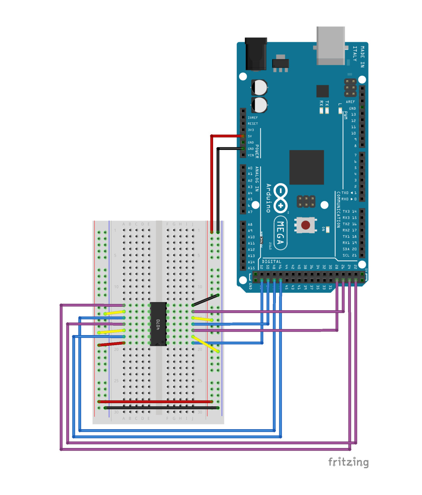
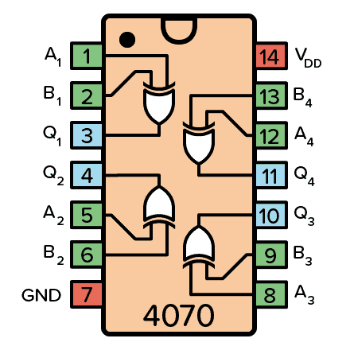

<details>
<summary> Serial Output</summary>

```
00110011
00111001
00110100
00110010
00101110
00110100
01100100
01100011
00110111
01101101
01100101
01100111
01100010
00110110
00110011
01100110
01100010
01100001
00110111
01100100
01100100
01100000
00110011
01100010
00110110
01100110
00110000
01100111
00110011
01100011
01100111
01100111
00110001
01101101
01100001
00110111
00110110
00101000
```

</details>

<details>
<summary> Wiring Diagram</summary>



</details>

<details>
<summary> Arduino Code</summary>

```c++
char * flag = "REDACTED";
String curr, first, second;
int in1=29, in2=27, in3=25, in4=23;
int out1=53, out2=51, out3=49, out4=47;
int i;

String get_output(String bits) {
    String output;
    digitalWrite(out1, ((bits[0] == '1')? HIGH : LOW));
    digitalWrite(out2, ((bits[1] == '1')? HIGH : LOW));
    digitalWrite(out3, ((bits[2] == '1')? HIGH : LOW));
    digitalWrite(out4, ((bits[3] == '1')? HIGH : LOW));
    delay(1000);
    output += String(digitalRead(in1));
    output += String(digitalRead(in2));
    output += String(digitalRead(in3));
    output += String(digitalRead(in4));
    return output;
}

//converts a given number into binary
String binary(int number) {
  String r;
  while(number!=0) {
    r = (number % 2 == 0 ? "0" : "1")+r; 
    number /= 2;
  }
  while ((int) r.length() < 8) {
    r = "0"+r;
  }
  return r;
}

void setup() {
  i = 0;
  pinMode(out1, OUTPUT);
  pinMode(out2, OUTPUT);
  pinMode(out3, OUTPUT);
  pinMode(out4, OUTPUT);
  pinMode(in1, INPUT);
  pinMode(in2, INPUT);
  pinMode(in3, INPUT);
  pinMode(in4, INPUT);
  Serial.begin(9600);
}

void loop() {
  if (i < strlen(flag)) {
    curr = binary(flag[i]);
    first = curr.substring(0,4);
    second = curr.substring(4,8);
    Serial.print(get_output(first));
    Serial.println(get_output(second));
    delay(1000);
    i++;
  }
}
```

</details>

Looking at the code we can break it down into a couple of steps:
1. loop over the flag covnerting each character into an 8-bit binary number
2. split the 8-bit binary number to two 4-bit binary numbers
3. perform a series of XOR operations that are hardwired in the wiring diagram to each 4-bits.
4. print the XOR'd 8-bit binary number to the serial

Refering to the datasheet of the XOR chip and the wiring diagram, we could identify our inputs and outputs and model the circuit in python.

Here's the pinout of the chip.
<center>



</center>


XOR is a reversible operation so we can easily pass the encrypted flag to the encryption algorithm to get it decrypted.

Below is the decryption script.
```python
#!/usr/bin/env python3

# This function will decode a 4-bit binary number passed as a string
def decode(bin_int):
    in1, in2, in3, in4 = [i for i in bin_int]
    out2 = int(in2) ^ 1
    out1 = int(in1) ^ 0
    out3 = 0 ^ int(in3)
    out4 = 1 ^ int(in4)
    out = []
    out.append(out1)
    out.append(out2)
    out.append(out3)
    out.append(out4)
    out = [str(i) for i in out]
    return "".join(out)

# wrapper for the decode() function that splits a 8-bit binary number and
# passes it to the decoding function returning the decrypted number.
def trans(big_bin):
    bin1, bin2 = big_bin[:len(big_bin)//2], big_bin[len(big_bin)//2:]
    return(int(decode(bin1) + decode(bin2), 2))

flag = []
with open("output.txt") as f:
    encrypted = f.read().split()
    flag = [chr(trans(i)) for i in encrypted]
print("".join(flag))
```

```
hegz@pop-os$ python3 solver.py
flag{a16b8027cf374b115f7c3e2f622d84bc}
```

<center>


</center>
