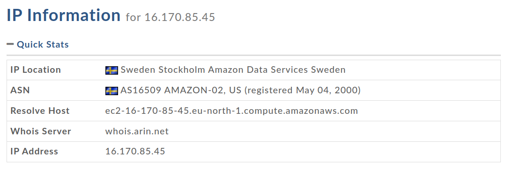
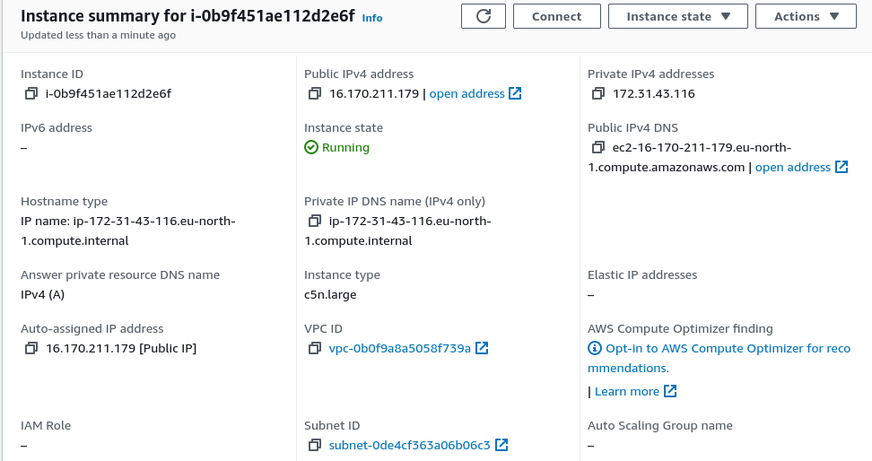
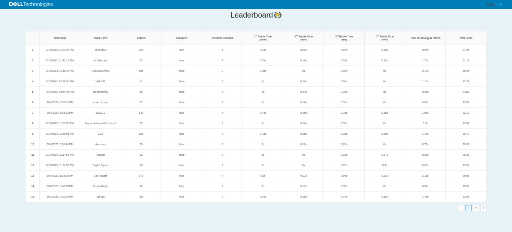
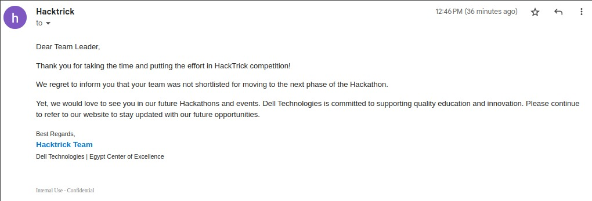
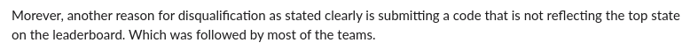

Are you ready to put your coding skills to the ultimate test? Hacktrick is the hackathon that combines AI, problem-solving, and cybersecurity to create a thrilling challenge. The landing page promises a rescue mission, but the real magic happens behind the scenes. As the competition heats up, we quickly realize that coding tricks alone won't guarantee a win. The question is, will we figure out the winning formula before the time runs out?

This year's problem statement is summarized as follows:
> Hacktrick is an AI hackathon that requires participants to design and implement an agent that can rescue trapped children from a maze and carry them to safety while solving a security riddle for each child. The agent must navigate the maze, locate the trapped children, and find the shortest path to rescue them while avoiding obstacles. The evaluation criteria are based on the number of children rescued, the number of actions taken within the allotted time, and the efficiency in solving the riddles.
    [You can find more details here.](https://github.com/hacktrick23/hacktrick23)
    
Competing teams were tasked with creating solver scripts to crack the codes of four different challenges, ranging from classical cipher decryption to pcap file analysis, JWT manipulation, and even automated captcha solving. These scripts were then used as callbacks to the maze-solver bot that we created. Some participants used fancy RL approaches, but we only had so much time left that we made a solution using the classical DFS.

We then recieved the scoring formula for the competition.
$$Score = \frac{Children_{Rescued} \times 1000}{Actions} + \frac{\sum Riddle_{Score}}{\sum Riddle\ Solve\ Time \times 10}$$

Keep in mind that every map will always have 4 children to rescue, each child will trigger one riddle with a max riddle score of 100.

Subsituting these boundaries in the Score equation, we get the following.
$$Score = \frac{4000}{Actions} + \frac{100}{\sum Riddle\ Solve\ Time \times 10}$$

Judging by some of the leaderboard scores, It seems that most people managed to get 100 actions on average and a total riddle solve time of 1 second.
# A Plan in Action
By calculating the gradient of the score function with respect to each of its parameters, we can gain insight into how each parameter affects the score function as a whole. It is very obvious that the riddle solving time has the greatest influence, but it never hurts to have some fun with math, does it?

```python
import tensorflow as tf

def score_func(A, T):
    # your scoring function
    return 4000/A + 100/(10*T)

# Define the parameter values and convert them to TensorFlow variables
A = tf.Variable(100.0)
T = tf.Variable(1.0)

# Compute the output of the scoring function using TensorFlow
with tf.GradientTape() as tape:
    output = score_func(A, T)

# Compute the partial derivatives of the output with respect to A and T
dA, dT = tape.gradient(output, [A, T])

# Print the partial derivatives
print("Partial derivative of the output with respect to A:", dA.numpy())
print("Partial derivative of the output with respect to T:", dT.numpy())
```
This showed that, on average, the riddle solving time had 25 times more influence on the score function than the actions taken (i.e., the rate of change of the score with respect to T is 25 times more than that of A). However, for us with our less performing algorithm that uses an average of 500 actions, we easily had over 625 relative sensitivity.
# Optimize to the Max
Our plan was to save as many children as possible to trigger as many riddles as we could, and then solve the riddles in the fastest time possible. Our team started working on the algorithm and optimization simultaneously, and we implemented the following optimizations.
## Code Optimization
Our solver scripts involved many third-party libraries. We started by benchmarking our runs and trying out various approaches. Here's the result of the first run of our scripts on my own laptop before implementing any performance-related changes.
```:Perf_Unoptimized.txt
CIPHER TIME = 2.5987625122070312e-05
CAPTCHA TIME = 0.09151816368103027
PCAP TIME = 0.03525257110595703
JWT TIME = 0.7002813816070557

Total Time Taken: 0.827078104019165
Est. Score: 12.09075654573039
```
One significant time waste was the JWT script, which accounted for ~85% of our total time. This was due to the following function.
```python
def generate_key_pair(filename):
    key = RSA.generate(2048)
    public_key = key.publickey().export_key("PEM")
    private_key = key.export_key("PEM")
    return private_key, public_key
```
Generating a 2048-bit key is a highly compute-intensive operation. No wonder it took so much time. We could reduce the key space to 1024, but that wouldn't be significant. We need to aim higher, and the answer is in caching! The key pair was saved on disk and accessed using the following function.
```python
def load_key_pair(filename):
    """
    Load an existing RSA key pair from files.
    """
    with open(f"{filename}.pem", "rb") as f:
        private_key = f.read()
    with open(f"{filename}.pub", "rb") as f:
        public_key = f.read()
    return private_key, public_key
```
This little optimization got us an order of magnitude faster!
```:Perf_Cached_Keys.txt
CIPHER TIME = 3.170967102050781e-05
CAPTCHA TIME = 0.14008831977844238
PCAP TIME = 0.04384732246398926
JWT TIME = 0.020376920700073242

Total Time Taken: 0.2043442726135254
Est. Score: 48.937021195171525
```
## Optimizing Our Python Implementation
We initially tried using PyPy, which only slowed us down. However, after [aboeleyes](https://twitter.com/abou_eleyes) suggested that we try using Python 3.11, we spent a lot of time compiling OpenSSL and Python 3.11. Eventually, we managed to achieve another 55% performance increase!
```:Perf_Python311.txt
CAPTCHA TIME = 0.08152127265930176
CIPHER TIME = 6.4849853515625e-05
JWT TIME = 0.013359308242797852
PCAP TIME = 0.024926185607910156

Total Time Taken: 0.11987161636352539
Est. Score: 83.42258412261475
```
## Network Latency Optimization
To ensure that our optimized code was not ruined, we also had to make sure that the network could quickly deliver our solutions to the hackathon's server. We began by querying a WHOIS lookup on the hackathon's backend IP address which is hosting the maze.



How lucky was that? I went straight to my AWS panel, changed my region to Stockholm, Sweden, and launched an instance in the same subnet as the hackathon's server. I chose a **c6n.large** instance, which is advertised as "ideal for high compute and bandwidth applications." It had a whopping 25 Gbps of speed.



# Results and Rant
After hacking for six hours with my team on Google Meet, we had a maze bot that was working, though not perfectly. It literally had one job and It is to save as many children as possible and hit as many riddles as It could, so our optimized solvers could go into action. We wrapped up after giving up on fixing some backtracking bugs and ran our solver on the remote machine. (Oh, did I mention that we only had one attempt at this? Yes, we did, due to me accidentally wasting four of our five attempts. :see_no_evil:)



We got a whopping #3, though we had only managed to solve 3 out of the 4 riddles but we got some really good timings (We even managed to solve the Cipher riddle in less than 0.01 seconds which apparently is rounded down to 0 on their leaderboard :smiling_imp:), I'm not sure how #1 managed to get these solve times without hardcoding their solution to be honest, these were some impressive number regardless of their legitimacy.
## Some Drama and More Ranting
The last bummer is our disqualfiication.


We were as surprised as you when we saw this, though when we reached out we didn't get anything useful in response lmao.




We double checked the version of our solver script that we sent them in the last minute (they requested that all hackathon teams send their solver scripts via email so they can make sure of their solution's legitimacy) and we noticed that we did a last minute change to our solver and forgot to send them the new version of the script, It's literally two lines of code that were moved under a new scope, I even sent them the diff with the latest version after the deadline but I got ignored (what?), I think the organizers should have reached out to teams before disqualifying them. Unfortunately, there is a significant mistake with their judging process as they only assess submissions based on the code and do not consider other crucial factors such as the environment that the code ran in. Nonetheless, we do not care that much to be honest, as we enjoyed the journey regardless of the destination. Hopefully, the organizers will learn from their mistakes for next year's hackathon.

 _mfw Literally Hacking the Hackathon_
# Shoutouts
Big shoutout to [Abdulrahman Wael](https://abdelrahman0w.github.io/), [Ibrahim Aboeleinen](https://aboueleyes.github.io/) and Maria Gamal It was very fun hacking together the last couple of days.

