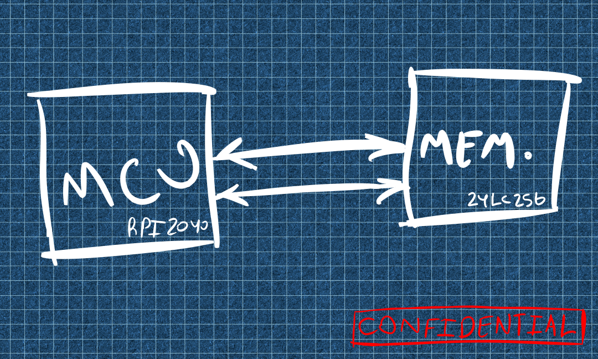
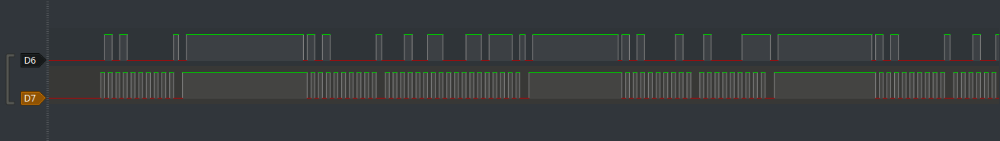
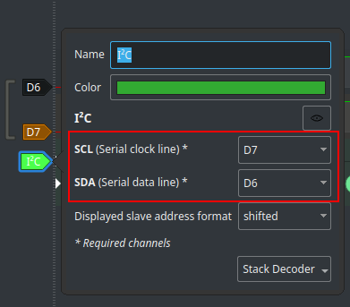
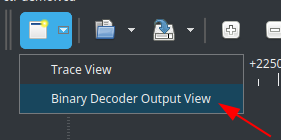
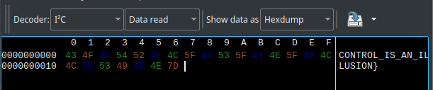
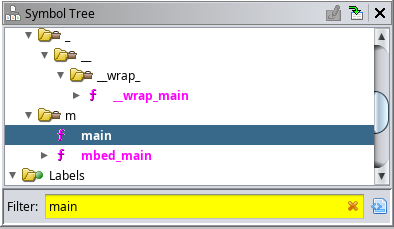

Challenge Name: A Hacker's Hunt
Challenge Description:
> Greetings, fellow hacker!
> Our skilled engineers have undertaken the daunting task of dissecting the firmware of our rival's cutting-edge security system, the "Safest Digital Safe 9000". Through their ingenuity, they've managed to accomplish the following:
> - Dump the firmware and obtain the binary code running on the microcontroller unit.
> - Intercept the bus connecting the MCU to the EEPROM using a logic analyzer, allowing them to obtain a signal dump.
> - The grapevine suggests that a leaked blueprint of an early prototype of their Safe is circulating on the darknet. Fortunately, one of our OSINT experts was able to procure it.
> 
> In addition to the aforementioned accomplishments, I'm pleased to inform you that our engineers have also included all three files for your perusal. You will find the binary code running on the MCU, the signal dump obtained through tapping the bus, and the leaked blueprint of our competitor's early prototype, all conveniently attached for your convenience. Happy analyzing!

In this challenge we are presented by three files.
- a binary that is supposedly running on a MCU
- bitstream dump of a signal
- a picture

We start by inspecting the attached picture.




It seems like we have a RPI2040 based MCU (Raspbery Pi Pico?) which is connected to an EEPROM with the part number `24LC256`.

Upon further research, It appears there's a [public datasheet](https://ww1.microchip.com/downloads/en/DeviceDoc/24AA256-24LC256-24FC256-Data-Sheet-20001203W.pdf) for this chip which mentions It uses the I<sup>2</sup>C protocol to communicate, this means that the signal dump we have recieved is most likely using the I<sup>2</sup>C communication protocol.


I<sup>2</sup>C is a simple communication protocol that allows multiple devices to communicate with each other using just two wires. One device acts as a master, initiating communication, while one or more devices act as slaves. Communication occurs through synchronized data exchange, with the master controlling the transmission rate. The two wires used for communication are SCK (serial clock) and SDL (serial data), which are used for clock synchronization and data transmission

## Signal Analysis

We can start by analyzing the given VCD file in any logic analyzer software, I will be using PulseView, once we open PulseView and start a new session, we will choose the `Import Value Change Dump Data` option from the open menu to import our signal, we are presented with a waveform as shown below.

We observe that there are only two signals present, one which is most likely a clock signal due to It's periodicity (D7).


Periodic Signals are signals that repeat the same pattern of high and low states at regular intervals. Clock signals are always periodic by design to ensure that digital circuits operate at the same rate and are synchronized with each other. The periodic nature of the clock signal provides an accurate and reliable timing reference, which is essential for ensuring that digital circuits function correctly and reliably.

These observation proves that the given waveform is an I<sup>2</sup>C signal, which consists of a serial data line (SDL) and a serial clock line (SCL), we can start decoding the signal by adding an I<sup>2</sup>C decoder from the protocol decoder menu.

After adding the decoder we can set It's channels to match our SDL and SCL which are D6 and D7.


Once we set them we can start seeing our signal getting decoded, to get a better visualization of our data, we navigate to the `Binary Decoder Output View` from the views menu.


Since we are only intersted in the data the MCU is reading from the EEPROM, we can filter `Data read` which will show some interesting data.


This seems to be a part of our flag, so we can save it somewhere. Upon further analysis of the signal, It seems there's nothing interesting in the dump.

## Binary Analysis
We start analyzing the binary, running `file` on the binary reveals that It is a 32-bit ARMv5 binary, It is not stripped so that will work in our favor too.

We load the binary in a decompiler of our choice, I will be using Ghidra since It is free and supports ARM.

Since the symbols are not stripped we can easily locate the main function in ghidra by searching for it in the symbol tree.


Below is the decompilation for main() that ghidra has generated.
```c
int main(void)

{
  EVP_PKEY_CTX *in_r0;
  PluggableUSBDevice *this;
  
  init(in_r0);
  initVariant();
  this = PluggableUSBD();
  arduino::PluggableUSBDevice::begin(this);
  arduino::USBSerial::begin(&_SerialUSB,0x1c200);
  setup();
  do {
    loop();
  } while( true );
}
```
We then peek at the `setup()` function which reveals a lot of stuff that is happening.

```c

void setup(void)

{
  bool bVar1;
  int iVar2;
  int extraout_r1;
  int extraout_r1_00;
  String flag;
  String key;
  String input;
  
  arduino::MbedI2C::begin(&Wire);
  arduino::String::String(&flag,"\x05\x03\x0f\x13)\a\t\x13\x05\x1c\x19\x13\a\x1a\a\b\x13");
  eeprom_read_string(&key,0x1337,0x17);
  xor_str(&flag,&key);
  do {
    do {
      iVar2 = arduino::UART::available(&_UART_USB_);
    } while (iVar2 == 0);
    arduino::Stream::readStringUntil(&input,(Stream *)&_UART_USB_,'\n');
    arduino::Print::println((Print *)&_UART_USB_,&input);
    bVar1 = arduino::String::equals(&input,&flag);
    if (bVar1) {
      arduino::Print::println((Print *)&_UART_USB_,"Unlocking Safe!");
      digitalWrite('\x01',HIGH);
      iVar2 = extraout_r1;
    }
    else {
      arduino::Print::println((Print *)&_UART_USB_,"Wrong pass!");
      iVar2 = extraout_r1_00;
    }
    arduino::String::~String(&input,iVar2);
  } while( true );
}
```
From some analysis of the above decompilation, the program is doing three main things.
1. Creates a variable `flag` with the type String that contains some bytes.
`arduino::String::String(&flag,"\x05\x03\x0f\x13)\a\t\x13\x05\x1c\x19\x13\a\x1a\a\b\x13")`
2. Reads a string that is 0x17 bytes long at address 0x1337 from the EEPROM, this is stored in the variable `key`
`eeprom_read_string(&key,0x1337,0x17);`
4. performs an inplace xor operation on the `flag` variable with the `key` variable.
`xor_str(&flag,&key);`

This means that we can decrypt the `flag` variable contents, If we could get the data read from the EEPROM, which we already have obtained in the previous step.

Below is a python script that will decrypt the flag.
```python
flag = b"\x05\x03\x0f\x13)\a\t\x13\x05\x1c\x19\x13\a\x1a\a\b\x13"
key = b"CONTROL_IS_AN_ILLUSION}"

for i in range(len(flag)):
    print(chr(flag[i] ^ key[i]), end="")

```
This will reveal the other part of the flag which is `FLAG{HELLOFRIEND_`, which means that the full flag is `FLAG{HELLOFRIEND_CONTROL_IS_AN_ILLUSION}`
