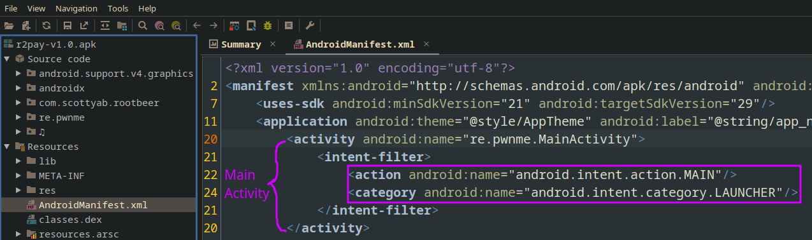

I have been doing some research into android security lately, and It was quite *different* than anything I have tried before, the eco system was more friendly than I imagined, a lot of frameworks and tooling was availiable. I will try to document some lessons learned from my little trip so that anyone (including future me) can learn.

## Initial Steps

Before starting any android application analysis, I love to start with a simple run of `APKiD` which is the android counterpart of the popular `PEiD`, It will scan all the classes and libraries of the android apk revealing the presence of any packer or obfuscator. It uses yara rules [under the hood](https://github.com/rednaga/APKiD/tree/master/apkid/rules).

## More Static Analysis

When dealing with android applications you will almost always have to start with static analysis, It's the fastest way to get a feel for the application and It will help you determine the next step of your analysis. JADX-GUI is what I have been using, I have seen some people using [Bytecode Viewer](https://github.com/Konloch/bytecode-viewer) for It's ability to quickly toggle different decompilers.

### Manifest the AndroidManifest

`AndroidManifest.xml` is usually my starting point, I have learned this the hardway. coming from an x86_64 background I usually started my reversing with locating either `main()`, `libc_start_main` or just the good ol' `_start`, however in android, there is no entry point function, and this is where the `AndroidManifest.xml` comes into play.

An Android app determines the main method by looking for the activity with the `android.intent.action.MAIN` and `android.intent.category.LAUNCHER` intent filters in the `AndroidManifest.xml` file.

### esreveR Engineering Commences

How to approach the reverse engineering process needs an essay on It's own, and I'm not the one to write that essay. However, the key answer to this question lies to what is your goal from reversing the application. below is a good example mindset.

> What you want to know about a strange binary (barring obfuscation, sandbox escapes, and other nasties) is: who does it talk to (ip addresses, hostnames, sockets, etc), what does it open (files, registry entries, api's, services), when does it do these things (eg. runtime conditions, magic packets, port knocks, triggers, checking for other software), where does it write or read data (directories, filehandles, remote sites, etc), why does it do this given it's stated purpose (why does it have an encrypted section, and where is its key, is it using weird encoding to bypass filters, etc.) and then finally the How it does these all things is the effect of answering those other questions.
> 
> I think the hardest part of analysis is having an organized way of knowing what you are looking for because we don't know the right questions to ask and we tend to work at the edge of limited knowledge. Should this rando binary be talking some app hosting site, and why? Why would a developer encode endpoint names in a lookup table that only constructs and returns them at runtime? Why would someone use any of these libraries or data formats on purpose? The harder it is to answer these questions, the more suspicious I get.
> 
> If you start with the 5-W's, the How falls out of that a lot faster. If you can answer these questions about a binary, you're easily 50% there in determining whether it behaves as expected. Having an organized goal can take you from zero to basically useful if you answer those questions about it. 
> 
> -- [src](https://news.ycombinator.com/item?id=35352229)

#### Static Analysis Tricks/Techniques

I will talk about some notable techniques I use, most of these are no sorecery and they are very common amongst reverse engineers.

##### 1. Strings

A quick look into the strings within an application can reveal a lot. This includes hardcoded secrets, crypto stuff, etc. I usually just use GNU strings, although you can use a lot of tools for analyzing strings. Some static analyzers, such as MobSF, will analyze the strings for you. You can also dump them manually using aapt from the Android SDK.

##### 2. Cross Reference Analysis

Let's say you found an intersting method definition but you want to dig deeper, on JADX-GUI you can press `x` and It will bring up all the x-refs for that method (This is also availiable in anything with **decompiler** in Its name)

I really use this a lot during my analysis and I recommend you do too!

##### 3.

## Dynamic Analysis

Enough talk with the boring static analysis, real men just deploy and enjoy. This is where stuff start to get serious, this is mainly due to the different paradigms of dynamic analysis and the plethora of tooling that is built for it.

Dynamic Analysis can be devided into two main paradigms:

- Debugging

- Instrumentation

I noticed that debugging is not as widely used, this is mainly due to the nature of the tasks being performed, debugging is a time consuming process but will give fine grained control over the dynamic analysis. On the other hand, instrumentation is very handy when we only care about a subset of the application functionality (ex. tracing a function/syscall)

Debugging involves stepping through instructions and setting breakpoints within the debugger, inspecting registers and the program memory. Instrumentation is basically hooking at certain parts of the program, these hooks can allow us to either read/write values to the program context (ex. we can read/write variables or registers).

Instrumentation can target different levels of abstraction, mainly:

- Function Level

- Instruction Level

- Basic Blocks

Instrumenting at the function level will allow one to dump the function arguments or return value, sometimes we need more accurate control of our dynamic analysis, and that's where we target the instruction level, this allows us to access the registers and memory at every instruction.

The most popular instrumentation framework for android is [Frida](https://frida.re/), It is very mature and has a big userbase, there are two main engines built into frida in which we can use, **Interceptor** which is the thing I have used the most, It allows hooking at the function or instruction level. a better but more complex alternative is **Stalker** which allows a more fine grained control though I haven't used much. Other DBI frameworks are out there such as Quarkslabs QBDI although It was too much for my usecase so I only used It once and switched back to Frida.

