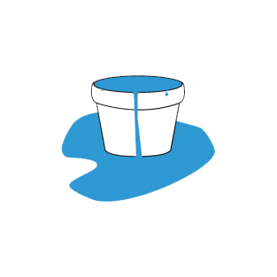

## What is a Buffer anyway?
We can think of buffers as containers to hold our data for later use, it's not really something specific to computer science; In fact, we have buffers in electronics, mechanics, chemistry and even politics!

We can say that the word buffer is just a fancy name for a placeholder (temporary storage)!

## Buffer in Computer Science

Now, it's time to get more technical and get to know buffers more in computer science!

Online video streaming is a pretty good application of buffering, back in the old days we would see YouTube showing that nostalgic loading bar while waiting the video to load and that's exactly why we use buffers!
We need to store video data in someplace so that when we need that data we can load it directly from the computer's memory since we can't really have our internet connection playback videos in realtime without having some temporarily storage for data to reside in, and that's the reason why livestreams never sync with realtime and have a couple seconds delay.

here is a more lower level representation of a buffer:

```c
#define BUFSIZE 1024
char buffer[BUFSIZE];
size_t len;

// ... later
while((len=read(STDIN, &buffer, BUFSIZE)) > 0)
    write(STDOUT, buffer, len);
```

This snippet basically check for data available then reads it from the standard input (command line) and writes that data back to the standard output (command line too).

## Buffer Overflows!

It's time for the good stuff now!

Let's say we have an arbitrary variable of size 5 bytes, and we stored some value in that variable which *exceeds 5 bytes*, that's a simple buffer overflow!

```c
char someVariable[5];

/* we are trying to copy 15 bytes to a 5 bytes sized variable */
memcpy(someVariable, "Hello, world!\n", 15); 

printf(someVariable);
```

We encounter buffer overflows more frequently than we imagine, ever seen `Segmentation Fault` appear in your C program out of nowhere? That's also a buffer overflow but your computer has prevented it from causing any damage and stopped the program from running.

Let's get back to our 5 bytes overflown variable example. What happens to the overflown data? Where is it's destination? Does it get lost in the void of nothingness?

Nope, in fact we just overwrite other data when we overflow any variable, and that's the core of our problem. We can't just overwrite data and act as if nothing happened. What if we overwrite important data? What if we can overwrite data related to process memory and already running programs? 

These are all possibilities which are just a mere consequence of buffer overflows and can cause great damage to computers

## Weaponizing Buffer Overflows

A basic technique used by hackers when exploiting buffer overflow vulnerabilities is determining the place where data gets overwritten and **handcrafting** the overflown data to inject **arbitrary code** in the program, imagine if that program runs at elevated privileges and a hacker takes control of it's execution flow, you get *pwned.*

And that's just the basic technique in abusing buffer overflow vulnerabilities.

## Am I Really Safe?

Sadly, yes you are safe.

Buffer overflows aren't as popular in 2020 (as of writing this article) as they used to be back in the old days of computers, all modern processors/operating systems have strict rules and mitigations for all the paradigms and techniques of buffer overflows.

Some of these famous mitigations are:

- **ASLR** (Address Space Layout Randomization)
  
  Basically randomizes all the memory addresses at runtime whenever you execute any program so it makes it impossible to hardcode memory addresses for exploiting buffer overflow attacks 
  
  i.e: the exploit needs to be completely dynamic

- **NX Bit**
  
  Basically marks areas of memory as non-executable, prevents hackers from injecting malicious code into areas of memory in an attempt to execute it.

- **Stack Canaries**
  
  Basically generates some random value in memory at runtime and checks before returning from any function if that random value got overwritten or not, if yes then program exits.

And these are just some of the basic mitigation used in 2020.

But again, *these doesn't really make your computer invincible* as much as making it just harder for an attacker to compromise your system using buffer overflow attacks.

Hackers still can bypass these mitigations using underhanded methods such as bruteforce and leaking addresses from memory but using these mitigations correctly can make buffer overflows nearly useless.

It's also worthy to mention that buffer overflows can be prevented from the programmers side by following the coding best practices and avoiding unsanitized input etc...
