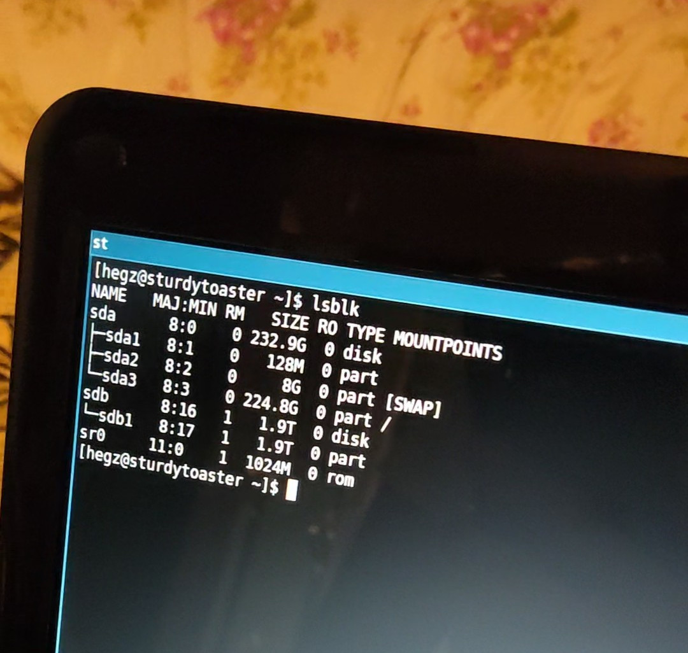

## First Impressions
I was really tempted to just plug that bad boy into my main PC, but I was worried It might [do something funny](https://en.wikipedia.org/wiki/USB_Killer), I didn't rush and instead booted a trusy old HP Pavilion I had around and booted it up, and ran a quick `lsblk` to list the devices connected.



We can clearly see that `sdb1` with 1.9TBs of storage, but is that all?

## Digging Deeper
Fight Flash Fraud, or rather [f3](https://github.com/AltraMayor/f3), is a suite of command line utilities that aids in detecting and verifying USB flash drives.

It consits of mutiple tools, mainly:
- f3probe\
This runs a quick capacity test on the flash drive

- f3fix\
Corrects the flash drive's capacity to the actual size

- f3write\
Writes large files to the flash drive

- f3read\
Checks the written files integrity


First run of `f3probe`
```
$ sudo f3probe --destructive --time-ops /dev/sdb
F3 probe 8.0
Copyright (C) 2010 Digirati Internet LTDA.
This is free software; see the source for copying conditions.

WARNING: Probing normally takes from a few seconds to 15 minutes, but
         it can take longer. Please be patient.

Bad news: The device `/dev/sdd' is a counterfeit of type limbo

You can "fix" this device using the following command:
f3fix --last-sec=2147483647 /dev/sdd

Device geometry:
	         *Usable* size: 1.00 TB (2147483648 blocks)
	        Announced size: 1.91 TB (4096000000 blocks)
	                Module: 2.00 TB (2^41 Bytes)
	Approximate cache size: 1.00 MB (2048 blocks), need-reset=no
	   Physical block size: 512.00 Byte (2^9 Bytes)

Probe time: 6.01s
 Operation: total time / count = avg time
      Read: 187.5ms / 4213 = 44us
     Write: 5.82s / 22706 = 256us
     Reset: 0us / 1 = 0us
```

The tool says that our flash drive is only 1TB, however, this was still too good to be true to me so I reran the command multiple time and the following was the output.

```
$ sudo f3probe --destructive --time-ops /dev/sdb
F3 probe 8.0
Copyright (C) 2010 Digirati Internet LTDA.
This is free software; see the source for copying conditions.

WARNING: Probing normally takes from a few seconds to 15 minutes, but
         it can take longer. Please be patient.

Bad news: The device `/dev/sdd' is a counterfeit of type limbo

You can "fix" this device using the following command:
f3fix --last-sec=101781503 /dev/sdd

Device geometry:
	         *Usable* size: 48.53 GB (101781504 blocks)
	        Announced size: 1.91 TB (4096000000 blocks)
	                Module: 2.00 TB (2^41 Bytes)
	Approximate cache size: 255.00 MB (522240 blocks), need-reset=no
	   Physical block size: 512.00 Byte (2^9 Bytes)

Probe time: 6'11"
 Operation: total time / count = avg time
      Read: 16.48s / 1049168 = 15us
     Write: 5'54" / 5749135 = 61us
     Reset: 0us / 2 = 0us
```

This makes more sense, I ran the fixing command it mentions in the output above, this corrects the capacity to the actual.
```
f3fix --last-sec=101781503 /dev/sdd
```

I was still worried of the integrity of these 48 GBs so I ran `f3write` on the mount point.

```
$ f3write /media/hegz/SUSB/
F3 write 8.0
Copyright (C) 2010 Digirati Internet LTDA.
This is free software; see the source for copying conditions.

Free space: 1.91 TB
Creating file 1.h2w ... OK!
Creating file 2.h2w ... OK!
Creating file 3.h2w ... OK!
Creating file 4.h2w ... OK!
Creating file 5.h2w ... OK!
Creating file 6.h2w ... OK!
Creating file 7.h2w ... OK!
Creating file 8.h2w ... OK!
Creating file 9.h2w ... OK!
Creating file 10.h2w ... OK!
Creating file 11.h2w ... OK!
Creating file 12.h2w ... OK!
Creating file 13.h2w ... OK!
Creating file 14.h2w ... OK!
Creating file 15.h2w ... OK!
Creating file 16.h2w ... OK!
Creating file 17.h2w ... OK!
Creating file 18.h2w ... OK!
Creating file 19.h2w ... OK!
Creating file 20.h2w ... OK!
Creating file 21.h2w ... OK!
Creating file 22.h2w ... OK!
Creating file 23.h2w ... OK!
Creating file 24.h2w ... OK!
Creating file 25.h2w ... OK!
Creating file 26.h2w ... OK!
Creating file 27.h2w ... OK!
Creating file 28.h2w ... OK!
Creating file 29.h2w ... OK!
Creating file 30.h2w ... OK!
Creating file 31.h2w ... OK!
Creating file 32.h2w ... OK!
Creating file 33.h2w ... OK!
Creating file 34.h2w ... OK!
Creating file 35.h2w ... OK!
Creating file 36.h2w ... OK!
Creating file 37.h2w ... OK!
Creating file 38.h2w ... OK!
Creating file 39.h2w ... OK!
Creating file 40.h2w ... OK!
Creating file 41.h2w ... OK!
Creating file 42.h2w ... OK!
Creating file 43.h2w ... OK!
Creating file 44.h2w ... OK!
Creating file 45.h2w ... OK!
Creating file 46.h2w ... OK!
Creating file 47.h2w ... OK!
Creating file 48.h2w ... OK!
Creating file 49.h2w ... Write failure: Input/output error

WARNING:
The write error above may be due to your memory card overheating
under constant, maximum write rate. You can test this hypothesis
touching your memory card. If it is hot, you can try f3write
again, once your card has cooled down, using parameter --max-write-rate=2048
to limit the maximum write rate to 2MB/s, or another suitable rate.

Creating file 50.h2w ... 2.46% -- 8.64 MB/s -- 84:20:56f3write: libflow.h:89: get_rem_chunk_size: Assertion `fw->blocks_per_delay > fw->processed_blocks' failed.
Aborted (core dumped)
```

This took around 3 hours to finish, I then ran `f3read`.
```
$ f3read /media/hegz/SUSB/
F3 read 8.0
Copyright (C) 2010 Digirati Internet LTDA.
This is free software; see the source for copying conditions.

                  SECTORS      ok/corrupted/changed/overwritten
Validating file 1.h2w ... 2097152/        0/      0/      0
Validating file 2.h2w ... 2097152/        0/      0/      0
Validating file 3.h2w ... 2097152/        0/      0/      0
Validating file 4.h2w ... 2097152/        0/      0/      0
Validating file 5.h2w ... 2097152/        0/      0/      0
Validating file 6.h2w ... 2097152/        0/      0/      0
Validating file 7.h2w ... 2097152/        0/      0/      0
Validating file 8.h2w ... 2097152/        0/      0/      0
Validating file 9.h2w ... 2097152/        0/      0/      0
Validating file 10.h2w ... 2097152/        0/      0/      0
Validating file 11.h2w ... 2097152/        0/      0/      0
Validating file 12.h2w ... 2097152/        0/      0/      0
Validating file 13.h2w ... 2097152/        0/      0/      0
Validating file 14.h2w ... 2097152/        0/      0/      0
Validating file 15.h2w ... 2097152/        0/      0/      0
Validating file 16.h2w ... 2097152/        0/      0/      0
Validating file 17.h2w ... 2097152/        0/      0/      0
Validating file 18.h2w ... 2097152/        0/      0/      0
Validating file 19.h2w ... 2097152/        0/      0/      0
Validating file 20.h2w ... 2097152/        0/      0/      0
Validating file 21.h2w ... 2097152/        0/      0/      0
Validating file 22.h2w ... 2097152/        0/      0/      0
Validating file 23.h2w ... 2097152/        0/      0/      0
Validating file 24.h2w ... 2097152/        0/      0/      0
Validating file 25.h2w ... 2097152/        0/      0/      0
Validating file 26.h2w ... 2097152/        0/      0/      0
Validating file 27.h2w ... 2097152/        0/      0/      0
Validating file 28.h2w ... 2097152/        0/      0/      0
Validating file 29.h2w ... 2097152/        0/      0/      0
Validating file 30.h2w ... 2097152/        0/      0/      0
Validating file 31.h2w ... 2097152/        0/      0/      0
Validating file 32.h2w ... 2097152/        0/      0/      0
Validating file 33.h2w ... 2097152/        0/      0/      0
Validating file 34.h2w ... 2097152/        0/      0/      0
Validating file 35.h2w ... 2097152/        0/      0/      0
Validating file 36.h2w ... 2097152/        0/      0/      0
Validating file 37.h2w ... 2097152/        0/      0/      0
Validating file 38.h2w ... 2097152/        0/      0/      0
Validating file 39.h2w ... 2097152/        0/      0/      0
Validating file 40.h2w ... 2097152/        0/      0/      0
Validating file 41.h2w ... 2097152/        0/      0/      0
Validating file 42.h2w ... 2097152/        0/      0/      0
Validating file 43.h2w ... 2097152/        0/      0/      0
Validating file 44.h2w ... 2097152/        0/      0/      0
Validating file 45.h2w ... 2097152/        0/      0/      0
Validating file 46.h2w ... 2097152/        0/      0/      0
Validating file 47.h2w ... 2097152/        0/      0/      0
Validating file 48.h2w ... 2097152/        0/      0/      0
Validating file 49.h2w ...  114938/        0/      0/      0 - NOT fully read due to "Input/output error"
Validating file 50.h2w ...       0/        0/      0/      0

  Data OK: 48.05 GB (100778234 sectors)
Data LOST: 0.00 Byte (0 sectors)
	       Corrupted: 0.00 Byte (0 sectors)
	Slightly changed: 0.00 Byte (0 sectors)
	     Overwritten: 0.00 Byte (0 sectors)
WARNING: Not all data was read due to I/O error(s)
Average reading speed: 31.29 MB/s
```

This confirms that the actual usable size of my USB is 48GB.
