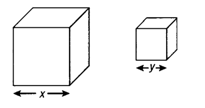

In this series of blog posts, I will be discussing some of my favorite topics in math, It mostly falls under the domains of mathematical logic and computability theory.

## Diophantus of Alexandria
Diophantus was a Greek mathematician that flourished around 250 AD, he is most famous for his book "Arithmetica" in which he had compiled 130 algebraic problems among thirteen books where most of their solutions were positive integers, and that's why mathematicians call such algebraic equations as "Diophantine Equations".

It is said that he wrote his book "Arithmetica" as a distraction from his son's death, and it turned out to be one of the most brilliant books that discussed algebra and he was amongst the first to use symbolic representations for real-life problems, he was also the first to use powers of more than 2 and 3 which had no physical meaning unlike the square and the cube, his solutions also never involved zeroes or negative numbers.

Diophantus had a brilliant way of solving problems involving multiple variables using only a single variable, he did it in such a way that he finds relations that represent the other variables in terms of the first variable.

## A Diophantine Problem

For Example, In his first problem of the fourth book:

> "Divide a given number into two cubes such that the sum of their sides is a given number".

He then provides two numbers:
> - Given Number: 370
> - Sum of Sides: 10

### Normal Approach
We can visualize the problem Geomterically as follows:

Let's solve it using second grade algebra!

The two sides ($x$ and $y$) add up to 10 and the sum of their cubes ($x^3$ and $y^3$)  is 370.\
$$x + y = 10$$
$$x^3 + y^3 = 370$$

$$x = 10 - y$$
$$(10 - y)^3 + y^3 = 370$$
$$(1000 + 30y^2 - 300y - y^3) + y^3 = 370$$
$$30y^2 - 300y + 630 = 0$$
$$y^2 - 10y + 21 = 0$$
$$(y - 7)(y - 3) = 0$$
$$\boxed{x = 7}\ \boxed{y = 3}$$

I didn't want to bother with a detailed explanation of the steps above (I hope all of those who are reading this know some basic algebra), here is how Diophantus solved such problems.
### Diophantus's Approach
He would first express the two variables $x$ and $y$ as two relations in terms of one variable so his $x$ will be $(5+x)$ and his $y$ will be $(5-x)$.\
$$(5 + x) + (5 - x) = 10$$

These indeed satisfy the first equation and will yield 10 upon adding them together, and for the second equation, he describes it as follows:\
$$(5 + x)^3 + (5 - x)^3 = 370$$

It will seem a bit odd and crazy at first, but once we start expanding these cubes, terms will start canceling out like crazy until we are left with:\
$$30x^2 + 250 = 370$$

Which will yield:\
$$x^2 = 4$$

Finally we arrive at the same solution:\
$$x = 2$$
$$(x + 5) = {\bf 7}$$
$$(x - 5) = {\bf 3}$$

his problems may seem plain and simple at the first glance but they sometimes become very tough and hard to attack, a famous quote by the German mathematician Hermann Hankel regarding the diophantine problems, "Every question requires a quite special method, which often will not serve even for the most closely allied problems. It is on that account difficult for a modern mathematician even after studying 100 Diophantine solutions to solve the 101st problem"

## Fermat's Last Theorem
Pierre de Fermat was a famous 17th-century French mathematician, he had a copy of Diophantus's Arithmetica and had filled its margins extensively with notes.\
At one of the problems that involved a solution in the form of $x^2\ +\ b^2\ =\ c^2$, Fermat wrote:
> "On the contrary, it is impossible to separate a cube into two cubes, a fourth power into two fourth powers, or generally any power above the second into two powers of the same degree. I have discovered a truly marvelous demonstration which this margin is too narrow to contain.”

This nonexistent proof became knows as “Fermat’s Last Theorem”, It was later solved by the British Number Theorist Andrew Wiles in 1993 after three and a half centuries, he then received the Abel Prize in 2016 for his solution.
