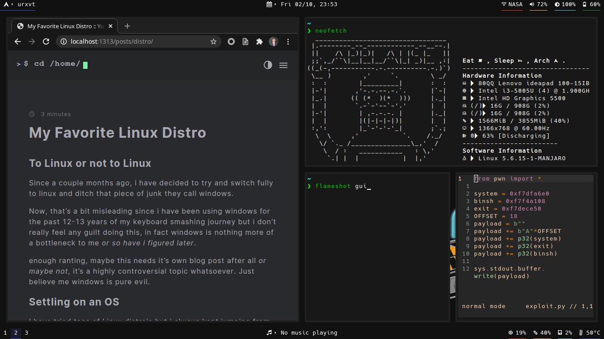
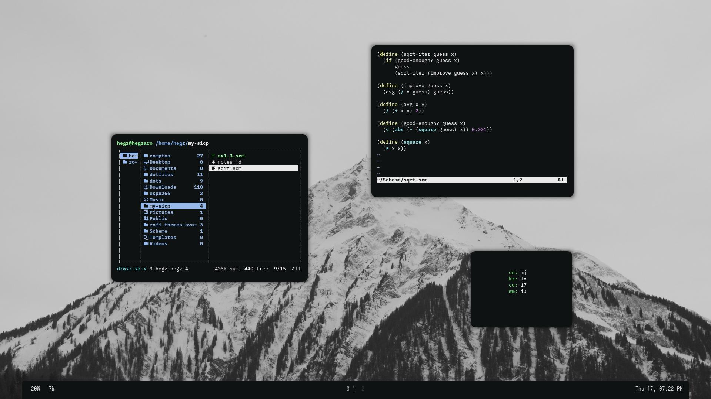

Now, that's a bit misleading since i have been using windows for the past 12-13 years of my keyboard smashing journey but i don't really feel any guilt doing this, in fact windows is nothing more of a bottleneck to me *or so have i figured later*.

enough ranting, maybe this needs it's own blog post after all *or maybe not*, it's a highly controversial topic whatsoever. Just believe me windows is pure evil.

## Settling on an OS
I have tried tons of Linux distrois but i always kept jumping from one to the next, never settled on a distro, at first i wanted to use it mainly for my cybersecurity hobby so i thought Kali would be a pretty nice choice...

but guess what, it wasn't...

I really think that kali is a pretty good OS but not that good for using as a daily driver system, it's just bloated with a tons of security tools that you will never get chance to use and maybe you don't even know of their existence.

so i started trying different operating systems ranging from the classic debian to using arch linux which actually was the thing i liked the most!

## Why Arch
beside the fact that you get to customize your operating system to the max level, you also get the Arch User Repository (AUR) which contains 64,441 packages as of writing this, it's a rolling release distro which basically gives you gradual little updates as they are released unlike other stable release distro that give you a bulky big update that sometimes forces you to reinstall your os.

Arch is a bit tougher than any other OS though, since they don't provide any graphical installer like most distros and you have to configure it yourself from the groundup, a pretty awesome arch based distro is **Manjaro** which is bascially a simpified version of arch with all Arch's perks and that's what i have setteled on!

## Manjaro for Cybersecurity
So we now have an arch distro that is lightweigt, fully customizable and contains an awesome package manager with the arch user repositoty, and that's not even the end! we can add to our manjaro setup [the blackarch repo](https://blackarch.org/downloads.html#install-repo) which contains as of writing this article a whooping 7030 security tool ready for installing at your fingertips!

now we can customize our own distro and bundle it with the tools we only need!

## The Sky's your limit
Manjaro comes in differnt desktop enviroments, but i have actually tried all of them inclduing XFCE, KDE and MATE and the one that sucked the least was XFCE...

but that was until i discovered the heaven of tiling window managers, which basically can speed up your keyboard smashing habits by 10x if you invested the little time into making it your own!

here are some pics of my Manjaro boxes!

[config](https://www.reddit.com/r/unixporn/comments/irhskz/i3_the_arctic/)

\
\

[config](https://www.reddit.com/r/unixporn/comments/ixexgc/i3gaps_someone_paid_my_bail_so_now_we_have/)
