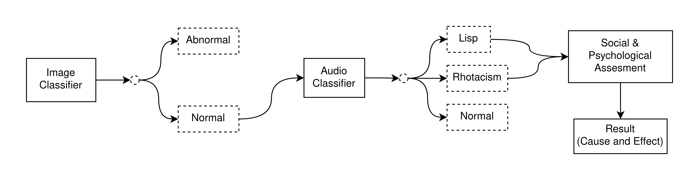

## Introduction
Artificial Intellegince has been prevalent lately, this can be accounted for many reasons but the most important is Moore's Law, the amount of compute power availiable to the average user let alone big corporations such as Microsoft and Facebook is way more than what we could get in the 90's.

This becomes clear when we observe the nature of the current state-of-the art trends in AI, the Transformer model which was proposed by Vaswani et al.[^attn_is_all_you_need] in 2017 rids of any feedback connections (RNNs) and only utilizes what they called "self-attention". This operation is highly-parallelizable and can exploit the large number of cores in modern GPUs.


A popular GPU that is widely used in AI is the Nvidia A100 which has 6912 CUDA cores, It's successor the H100 has 18,432 CUDA cores!


## Overview of the project
Our project addresses the problem of articulation disorders diagnosis in the Arabic language, we take a multimodal approach to solve this problem, we first identify whether the disorder is of a physiological nature or not, this is achieved through a binary image classifier that is trained on public pictures of patients with hare lip, we only chose hare lip for our prototype due to its abundance of data.

Once the patient has been classified to have an abnormality we do nothing further, on the other hand, If the patient doesn't have a physiological disorder then we proceed to the second stage of the pipeline which is the audio analysis phase. In this phase the patient utters mutliple words in a microphone that feeds into an LSTM model to further classify the patient's articulation disorder (Lisp, Rhotacism, ...), the model was trained on data that we gathered locally.

After the articulation disorder has been classified, the patient undergoes a written questionnaire that identifies whether the disorder could be due to psychological or social reasons.

The following picture shows an overview of the first iteration of our project (yes this is a hint that we did a second iteration).

I will focus on the audio pipeline in this blog post, the image pipeline was the work of my dear friend Mostafa[^darsh].

## NLP in AI
NLP is a very old problem, It involves the modeling of human speech into a form understandable by computers, after getting our audio into a state that is easy to work with, we need a way classify this audio which is of temporal nature (varies in time), hence we decomposed our problem into a classification problem, but the problem with data that has a temporal nature is it's causal nature.


A causal system is one whose output depends only on the present and the past inputs.


This is where we start using the recurrent neural network to model our data, the RNN is a type of neural network that has feedback, this is neccessary to model temporal data since the network's output is always dependant on the past data, this network archeticture proved to be problematic when dealing with very large data sizes, this is due to the failure of the model to capture information that is far away from the current word due to the vanishing gradiennt problem[^vanishing_grad]

In 1997 a research paper was published that introduced a new RNN archeticture called the "Long Short-Term Memory" (LSTM), this archeticture dealt with the vanishing gradient problem by introducing a gating mechanism inside the cells of the network, this enables us to control the gradient flow within the cell so we can prevent the gradient from vanishing or exploding.

## LSTM for audio classification
After tedious days of data gathering, cleaning and labeling. we ended up with around 15 minutes of audio data, this seemed so little but we kept going anyway.

We kept experimenting with different model hyperparameters on a validation dataset but every single try showed a sign of overfitting, It became clear that we could no longer progress further with the little data that we have, and hence we started with plan B.

## Plan B: Transformers
I was always interested about transformers, I was initially planning to finetune a transcription model like whisper by OpenAI on the little data that I have, but I was very skeptical it would be make any difference If I trained it on 15 minutes, after looking around for the hottest finetuned models for the arabic language I saw the work of ArabML[^arabml] in the whisper fine-tuning event by huggingface, they had finetuned a model that achieved a WER of 12.0 and It was on an arabic dataset of Egyptian dialect[^whisper-model]!

This was exactly what I needed so I started experimenting with the model through the free huggingface inference API, It didn't transcribe the incorrect words very accurately probably due to the normalization that is associated with automatic speech recoginition (ASR) models but It was something I could work with.

I created a list of all the possible wrong words (that has articulation errors) that we will face along with the corresponding correct words, this can be shown from the below image.

After creating this list, we just feed the transcribed text to an algorithm that can find the closest match from our words list, this process is repeated for all the uttered words and we have a list of all the wrong words that was uttered along with their corresponding correct word. the difference between these two words will be the substited letter.
[^whisper-model]: https://huggingface.co/Zaid/whisper-large-v2-ar
[^arabml]: https://arbml.github.io/
[^vanishing_grad]: https://en.wikipedia.org/wiki/Vanishing_gradient_problem
[^attn_is_all_you_need]: https://proceedings.neurips.cc/paper_files/paper/2017/file/3f5ee243547dee91fbd053c1c4a845aa-Paper.pdf
[^darsh]: https://www.linkedin.com/in/mostafa-m-mokthar-7aa2a7192/

