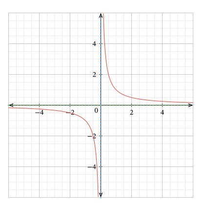
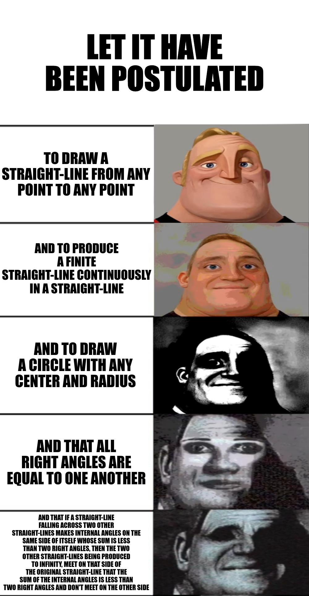
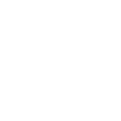

## Background and History
David Hilbert was a German mathematician born in 1862, he was born near Konigsberg which was the home of the infamous University of Konigsberg commonly known as "The Albertina".
<!-- more -->

It is also worth mentioning that he didn't like school and described himself during the school life as being "dull and silly" and that's coming from someone who made a gigantic impact on mathematics.

The University of Konigsberg was where some of the most brilliant minds taught, such as Immanuel Kant and even Hilbert himself studied and later on taught there as well, during his time studying he made friends with the young Hermann Minkowski which greatly influenced his future.

After his graduation from Konigsberg he applied and got accepted at a position in the University of Gottigen. which is another infamous place where Gauss and Weber worked on the Electromagnetic Telegraph, Hilbert was then assigned to run the math department along with Felix Klein.

## Hilbert and Geometry
Before we mention Hilbert's contributions to geometry, It's important to know the current context of geometry in that era which I'm going to go over briefly in the succeeding paragraphs.

### Euclid's Postulates
Prior to the nineteenth century, no mathematician considered the truthfullness of Euclid's postulates, and especially the fifth postulate about parallel lines, the postulate was logically equivalent to saying:
> Through a point outside a given line, only one parallel line can be drawn.

This fifth postulate was different from the first four postulates as It was not intuitive as the first four, It also was closely bound to the concept of infinity as the original postulate described parallel lines as:

> Being produced indefinitely in both directions.

which means that parallel lines will never meet even at infinity, however, the ancient greeks were familiar with lines that in fact, do meet at infinity, they are called asymptotes.

**Bonus Meme:**

## A quest to prove the fifth postulate
Many people started questioning the truthfulness of the parallel postulate, that uncertainty was a byproduct of the introduced intuition and Hilbert wanted a trustworthy way to reason about geometry without relying on intuition, he wanted an abstract geometry where words are emptied from their meaning, which ultimately will rid reasoning about geometry from any intuition bias.

> One must be able to say at all times – instead of points, straight lines, and planes – tables, chairs and beer mugs. 
> — <cite>David Hilbert</cite>

## Cantor's Paradise
George Cantor was the first mathematician to see that there are a multitude of different infinities, some are even larger than others.

Let's dive a little deeper into Cantor's theory, we will borrow a couple of definitions from set theory.

> two sets are said to have the same **Cardinality** if there is a one-to-one correspondence between them, where Cardinality is the number of elements in the set.
> 
> **i.e.** X and Y have the same Cardinality

One of his greatest discoveries was that multiple infinite sets can have different cardinalities\
i.e. there are different sizes of infinite sets (but that's for another day).

We might need to point out the difference between three important keywords we will be using.

**Axiom:**
>  A seemingly self-evident or necessary truth which is based on assumption.[^axiom_wikitionary]

**Formula:**
> A sentences which follow the formation rules of a system.

**Theorem:**
>  A formula which is derived from the axioms.

Hilbert made most of his fame by tackling unsolved problems in algebra and number theory.

He later found himself teaching a class on Geometry at Gottingen which made him shift toward Geometry for that time period, he wanted to create a solid foundation for the modern geometry at the time so he started re-axiomatizing both Euclidean and Non-Euclidean geometries. He published his book "Grundlagen der Geometrie" in which he placed geometry on a formal axiomatic setting consisting of 20 axioms.

In his book, he constructed an analogue of his geometry within the Cartesian coordinate system in which he shifted the consistency problem of his geometry to that of the consistency of real numbers and arithmetic.

[^axiom_wikitionary]: [Axiom - Wikitionary](https://en.wiktionary.org/wiki/axiom#English).
