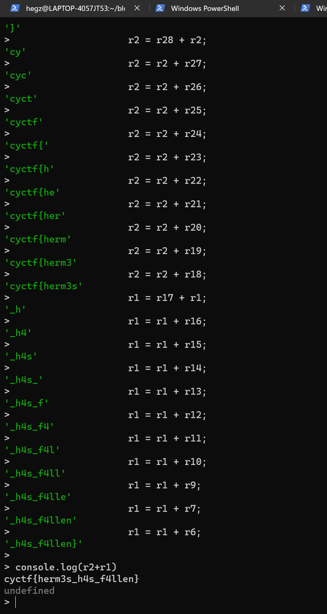

I started by installing the APK on an android phone, once opened it will show a text field to enter a key and a login button, the APK will try to navigate to `https://you-shall-not-pass` when trying to type any key (maybe this was done to prevent bruteforcing the key?), finally, when you try to login with a random key It will show a dialog saying "BAAAD Key"

<center>
<video controls loop width="320">
    <source src="./demo.mp4" type="video/mp4">
</video>
</center>


I dropped the APK within jadx and I went to the entry point which is `com.expor4bb1t.AwesomeProject.MainActivity`, I could see a lot of imports related to facebook and react, which along with the challenge name, started making sense. This application is built with react native.

It turns out that react native applications basically can run java script code that is located in `assets/index.android.bundle`
However, in our case, the javascript code was compiled into what is called "Hermes Bytecode", which is run by a custom javascript engine.

This bytecode makes the application faster but is gibberesh to humans, this is why we have to either disassemble it into readable hermes assembly, or even better, we can decompile it into javascript.

I found https://github.com/bongtrop/hbctool which is a disassembler for the hermes bytecode, however It didn't work for me as It only supports up to version 85 of the bytecode, and our apk seems to be version 94 so the tool errors out.
```
PS C:\Users\hegzp\Downloads\ReactiveVaultStuff\assets> hbctool disasm .\index.android.bundle out.hasm
[*] Disassemble '.\index.android.bundle' to 'out.hasm' path
Traceback (most recent call last):
  ...
  <snip>
  ...
AssertionError: The HBC version (94) is not supported.
```

I found this [writeup](https://github.com/Pusty/writeups/tree/master/InsomnihackTeaser2022#herald) where that author faced a similar problem, and apparently, adding support for newer versions shouldn't be that hard, but I decided to dig a little more and I found this [repo](https://github.com/P1sec/hermes-dec), It is basically a decompiler for hermes and they even support our bytecode version.

I ran the tool on the `index.android.bundle` using `hbc-decompiler.exe .\index.android.bundle out.js` to get a decompilation of the bytecode.
Once I found this decompiled code, I did a search for the `BAAAD Key` string that we saw in the APK earlier, and I found one result.

```javascript
case 0:
                            r1 = _closure2_slot0;
                            if(r1) { _fun7649_ip = 31; continue _fun7649 }
case 10:
                            r1 = global;
                            r3 = r1.alert;
                            r2 = undefined;
                            r1 = 'Empty Inputt!!';
                            r1 = r3.bind(r2)(r1);
                            _fun7649_ip = 91; continue _fun7649;
case 31:
                            r2 = _closure2_slot2;
                            r1 = _closure2_slot3;
                            r1 = r2 + r1;
                            r0 = _closure2_slot0;
                            if(!(r0 !== r1)) { _fun7649_ip = 72; continue _fun7649 }
case 51:
                            r0 = global;
                            r2 = r0.alert;
                            r1 = undefined;
                            r0 = 'BAAAD Key';
                            r0 = r2.bind(r1)(r0);
                            _fun7649_ip = 91; continue _fun7649;
case 72:
                            r0 = global;
                            r2 = r0.alert;
                            r1 = undefined;
                            r0 = 'Congratssss!';
                            r0 = r2.bind(r1)(r0);
```

This seems to be some sort of switch logic for the login button, I did some more digging then I found this suspicious piece of code, It was just above the login switch logic that we discussed in the above paragrarph.

```javascript
case 0:
                    r0 = a0;
                    r0 = r0.navigation;
                    r1 = _closure1_slot3;
                    r2 = r1.useState;
                    r3 = undefined;
                    r1 = '';
                    r4 = r2.bind(r3)(r1);
                    r1 = _closure1_slot2;
                    r2 = r1.default;
                    r1 = 2;
                    r4 = r2.bind(r3)(r4, r1);
                    r2 = 0;
                    r5 = r4[r2];
                    r2 = 1;
                    r4 = r4[r2];
                    r30 = "Within a vault, a secret's hidden tight,";
                    r6 = 20;
                    r28 = r30[r6];
                    r11 = 'LocKed aw4y, in shadows it does hide,';
                    r2 = 10;
                    r2 = r11[r2];
                    r27 = r30[r6];
                    r26 = r30[r1];
                    r13 = "The alphabet's secrets take their flight.";
                    r12 = 34;
                    r25 = r13[r12];
                    r29 = "From {'A'} to {'Z'} the secrets share.";
                    r7 = 5;
                    r24 = r29[r7];
                    r1 = 3;
                    r23 = r30[r1];
                    r9 = 19;
                    r22 = r30[r9];
                    r6 = 21;
                    r21 = r30[r6];
                    r20 = r29[r1];
                    r6 = 'In this hidd3N space, both dark and bright!';
                    r10 = 12;
                    r19 = r6[r10];
                    r15 = 18;
                    r18 = r30[r15];
                    r31 = 'A treasure trove of tales, far and wide_';
                    r14 = 39;
                    r17 = r31[r14];
                    r1 = r30[r1];
                    r6 = 9;
                    r16 = r11[r6];
                    r15 = r30[r15];
                    r14 = r31[r14];
                    r13 = r13[r12];
                    r12 = r11[r6];
                    r11 = r30[r10];
                    r10 = r30[r10];
                    r9 = r30[r9];
                    r7 = r30[r7];
                    r6 = r29[r6];
                    r2 = r28 + r2;
                    r2 = r2 + r27;
                    r2 = r2 + r26;
                    r2 = r2 + r25;
                    r2 = r2 + r24;
                    r2 = r2 + r23;
                    r2 = r2 + r22;
                    r2 = r2 + r21;
                    r2 = r2 + r20;
                    r2 = r2 + r19;
                    r2 = r2 + r18;
                    r1 = r17 + r1;
                    r1 = r1 + r16;
                    r1 = r1 + r15;
                    r1 = r1 + r14;
                    r1 = r1 + r13;
                    r1 = r1 + r12;
                    r1 = r1 + r11;
                    r1 = r1 + r10;
                    r1 = r1 + r9;
                    r1 = r1 + r7;
                    r1 = r1 + r6;

```

I could recognize this immediatly as some sort of dynamic string construction, so I just threw it in a js repl.

